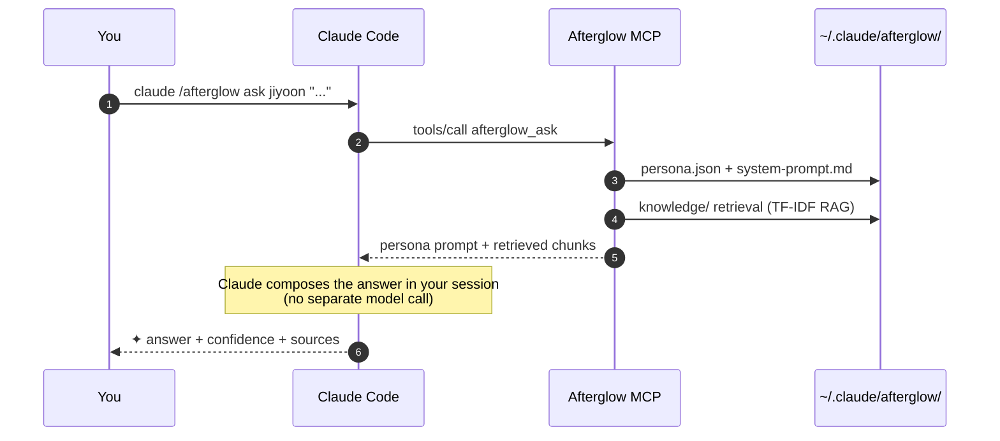

<div align="center">

# Afterglow

**Turn your departed teammate into an agent. Make offboarding seamless.**

<p>
  <a href="./README.md"></a>
  
</p>

<p>
  <a href="https://www.npmjs.com/package/@daeseoksong/afterglow-mcp"></a>
  <a href="https://www.npmjs.com/package/@daeseoksong/afterglow-mcp"></a>
  <a href="./LICENSE"></a>
  <a href="https://github.com/DaeSeokSong/Afterglow/stargazers"></a>
  <a href="https://github.com/DaeSeokSong/Afterglow/commits/main"></a>
  <a href="https://github.com/DaeSeokSong/Afterglow/issues"></a>
</p>

<p>
  
  
  
  
  
</p>

<p>
  <a href="#-tldr"><b>30-second tour</b></a> ·
  <a href="#-one-line-install-mcp-server">Install</a> ·
  <a href="#-interactive-proposal-frontend">Frontend demo</a> ·
  <a href="#-keyboard--navigation">Shortcuts</a> ·
  <a href="#-folder-structure">Folders</a> ·
  <a href="#-roadmap">Roadmap</a> ·
  <a href="./server/README.md"><b>MCP server →</b></a>
</p>

</div>

---

## ⏱ TL;DR

```bash
claude mcp add afterglow npx -y @daeseoksong/afterglow-mcp
claude /afterglow init
claude /afterglow create jiyoon --name 이지윤 --role "Product Designer"
claude /afterglow sign jiyoon --signer "Jiyoon Lee"
claude /afterglow ask jiyoon "Onboarding step-3 drop-off — how did you cut it?"
```

```
✦ Step-3 drop-off wasn't really a step-3 problem. We trimmed the step-2
  explanation in half and drop-off went 22% → 9%.        — Jiyoon · 91% confidence

  ↗ Confluence · DESIGN/onboarding-v2-postmortem
  ↗ ./materials/interview-2025-11-10.pdf · p. 14
```

> No fine-tuning. **Persona + RAG** only — 100% compatible with Claude Code. Zero extra GPUs, embedding APIs, or external servers.

---

## 🗂 What's in this repo

<table>
  <thead>
    <tr>
      <th width="50%">📐 <code>/</code> — Interactive proposal (frontend)</th>
      <th width="50%">⚙ <code>/server</code> — Real MCP server</th>
    </tr>
  </thead>
  <tbody>
    <tr>
      <td>
        Claude Design hand-off migrated to <b>Vite 8 + React 19</b>.<br>
        18 CLI screen mock-ups so you can walk the whole flow before installing anything.
      </td>
      <td>
        <a href="https://www.npmjs.com/package/@daeseoksong/afterglow-mcp"><code>@daeseoksong/afterglow-mcp</code></a> on npm.<br>
        Register it and Claude Code gets 24 slash commands (<code>init · create · handoff · sign · resume · list · inspect · ask · edit · council · council_summary · history · audit · recalibrate · correct · archive · version · access · interview · export · import · verify · status · gc</code>).
      </td>
    </tr>
    <tr>
      <td>
        <code>npm install && npm run dev</code> → <code>http://localhost:5173</code>
      </td>
      <td>
        <code>claude mcp add afterglow npx -y @daeseoksong/afterglow-mcp</code>
      </td>
    </tr>
  </tbody>
</table>

---

## ✦ One-line install (MCP server)

```bash
claude mcp add afterglow npx -y @daeseoksong/afterglow-mcp
```

Then your first session (5 commands):

```bash
claude /afterglow init                                                # bootstrap ~/.claude/afterglow/
claude /afterglow create jiyoon --name 이지윤 --role "Product Designer"
claude /afterglow sign jiyoon --signer "Jiyoon Lee"                   # consent → status active
claude /afterglow list
claude /afterglow ask jiyoon "..."
```

See [`server/README.md`](./server/README.md) for the full tool reference.

> **Two ways to invoke.** Afterglow is an MCP server, so the actual tool calls are JSON like `afterglow_handoff({slug: "jiyoon", action: "start"})`. You can drive it either way:
> 1. **Natural language** — say "initialize afterglow" and Claude picks the right tool.
> 2. **Slash command** — from Claude Code's prompt box, **`/mcp__afterglow__<name>`** (e.g. `/mcp__afterglow__init`, `/mcp__afterglow__ask`) with argument auto-complete. (Exposed as MCP prompts — note the form is `/mcp__afterglow__init`, not `/afterglow init`.)
>
> The `claude /afterglow …` notation in this README is shorthand for readability; in practice use one of the two ways above.

### ⌨ Slash-command examples (`/mcp__afterglow__*`)

Type `/mcp__afterglow__` in Claude Code's prompt box → an autocomplete list appears; pick one and it asks for the arguments. (Parenthesized args are optional.)

| Goal | Slash command | Arguments | Natural-language alternative |
| --- | --- | --- | --- |
| Initialize | `/mcp__afterglow__init` | (none) | "initialize afterglow" |
| Create agent | `/mcp__afterglow__create` | `slug` `name` `role` (`tenure` `bio`) | "create agent jiyoon, Jiyoon Lee, product designer" |
| Sign → active | `/mcp__afterglow__sign` | `slug` `signer` | "sign jiyoon as Jiyoon Lee" |
| List | `/mcp__afterglow__list` | (`status`) | "show afterglow list" |
| Dashboard | `/mcp__afterglow__status` | (none) | "afterglow status" |
| Inspect | `/mcp__afterglow__inspect` | `slug` | "inspect jiyoon" |
| Ask | `/mcp__afterglow__ask` | `slug` `question` | "ask jiyoon how the payment fallback worked" |
| Edit | `/mcp__afterglow__edit` | `slug` (`bio` `name` `role` / `open` / `revalidate`) | "change jiyoon's bio to …" |
| Self-handoff | `/mcp__afterglow__handoff` | `slug` `action` (`signer`) | "start a handoff for jiyoon" |
| Interview | `/mcp__afterglow__interview` | `slug` `action` (`session` `title` `interviewer`) | "start an interview for jiyoon, title Payment gaps, interviewer J. Kim" |
| Council | `/mcp__afterglow__council` | `slugs` `question` | "convene jiyoon and jaehoon" |
| Export | `/mcp__afterglow__export` | `slugs` or `all` | "export jiyoon" |
| Import | `/mcp__afterglow__import` | `input` (`expectAnchor`) | "import this bundle: ./afterglow-export-…/" |
| GC / retention | `/mcp__afterglow__gc` | `action` (`slug` `apply`) | "preview pruning old snapshots" |
| Resume | `/mcp__afterglow__resume` | `slug` | "resume jiyoon" |

**Example flow** (slash):
```text
/mcp__afterglow__init
/mcp__afterglow__create     → slug: jiyoon · name: Jiyoon Lee · role: Product Designer
/mcp__afterglow__sign       → slug: jiyoon · signer: Jiyoon Lee
/mcp__afterglow__ask        → slug: jiyoon · question: how did you cut step-3 drop-off?
/mcp__afterglow__interview  → slug: jiyoon · action: start · title: Payment gaps · interviewer: J. Kim
```

> Tools with many arguments (e.g. interview `attach`/`answer`) are often easier in natural language. Slash commands shine for the frequent entry points (init, create, ask, status, …).

**Three ways to edit:**
- **Fields directly**: `/mcp__afterglow__edit` → `slug` + `bio`/`name`/`role` (structured patch, auto-validated + system-prompt regenerated + snapshot)
- **Open in an editor**: `open=true` → prints the `persona.json` path + makes a backup snapshot. Open it in `vim`/`code`/… and edit raw
- **Revalidate**: after editing, `revalidate=true` → validates your edited `persona.json` (rejects + keeps the file if invalid) + regenerates `system-prompt.md` + snapshot
  ```text
  /mcp__afterglow__edit  (slug: jiyoon, open: true)        → prints persona.json path
  # vim ~/.claude/afterglow/agents/jiyoon/persona.json     → edit & save
  /mcp__afterglow__edit  (slug: jiyoon, revalidate: true)  → validate + regenerate
  ```

## 📐 Interactive proposal (frontend)

18 CLI screen mock-ups that walk you through every command and edge case:

```bash
npm install
npm run dev      # → http://localhost:5173
```

| Group | Screens | Slash commands |
| --- | --- | --- |
| At a glance | Overview | (intro) |
| Setup · Handoff | Install · Create agent · Self-review handoff | `init` · `create` · `handoff` |
| Daily | List · Ask · Inspect · Edit · History | `list` · `ask` · `inspect` · `edit` · `history` |
| Multi-agent | Council · Re-read transcript | `council` · `log` |
| Ops | Versions · Access · Audit · Manual / auto recalibration | `version` · `access` · `audit` · `correct` · `recalibrate` |
| Reference | Roadmap · Ethics | — |

## ⌨ Keyboard / Navigation

| Shortcut | Action |
| --- | --- |
| <kbd>⌘ K</kbd> / <kbd>Ctrl K</kbd> / <kbd>?</kbd> | Command palette (fuzzy search across 18 screens) |
| <kbd>g</kbd> + <kbd>l/a/i/c/e/h/o/v</kbd> | Jump to list / ask / inspect / create / edit / history / overview / versions |
| <kbd>[</kbd> / <kbd>]</kbd> | Previous / next screen |

- Clickable `T.Cmd` snippets and helper card commands matching `/afterglow <verb>` jump to the corresponding screen.
- Agent chips (`T.Agent`) jump to the inspect screen.
- Topbar ←/→ buttons, footer prev/next jump cards.

## 🙋 Self-review onboarding (`afterglow_handoff`)

A week or two before leaving, the person sits down for a 1-on-1 review session with their own agent:

```bash
# 1. Start — auto-generate N sample questions (or load coworker-written questions.txt)
claude /afterglow handoff jiyoon --action start --limit 12

# 2. Review — keep / edit / decline each question
#    edit: write your own answer to override the agent's draft
#    decline: "I won't answer that — please ask someone else"
claude /afterglow handoff jiyoon --action review \
  --reviews '[{"id":"q-…","action":"edit","userAnswer":"…"}, …]'

# 3. Status (any time)
claude /afterglow handoff jiyoon --action status

# 4. Self-sign + flip to active
claude /afterglow handoff jiyoon --action finalize --signer "Jiyoon Lee"
```

- Edited / declined answers are absorbed into `persona.bio` as `## handoff 답변` / `## 답하지 않기로 한 영역` blocks so future `ask` calls cite them first.
- Every step lands in `audit.log` + `history.log` with the hash-chained trail.
- Resume by re-running the same command. `--action abort` discards. `--sign-partial` finalises even with pending items.

This delivers on the core promise:
> *"A digital self the person actually consented to."* Persona extracted from raw materials may diverge from the person's intent, so the review pass is mandatory.

### Self-handoff vs HR-delegated handoff

| Case | Who signs | `--signer` value | Recommended flow |
| --- | --- | --- | --- |
| Person reviews before leaving | Themselves | `"Jiyoon Lee"` | `/afterglow handoff … --action finalize` |
| Person already gone / unreachable | HR or manager on their behalf | `"HR · J. Kim (delegated, person unavailable)"` | Same command. The signer string **must** flag the delegation explicitly |
| No consent at all | (Do not sign) | — | Keep the agent at `paused`; never finalize |

`afterglow_sign` / `handoff finalize` **trust the `signer` string verbatim** — they record it in `consent.md` and `audit.log` but do **not** perform identity verification (SSO / MFA). This is a deliberate PoC choice: in production, wrap the tool with SSO tokens, corporate ID checks, or an HR approval system.

## 🎤 Follow-up interviews (v0.2) — the successor interviews the leaver

Where `handoff` is the leaver's **one-time self-review**, `interview` is the flow where **the successor (the person taking over) interviews the leaver across multiple rounds** — because once you actually touch the material, new questions surface and gaps the leaver missed become obvious.

```bash
claude /afterglow interview jiyoon --action start --title "Payment gaps" --interviewer "J. Kim" --interviewee "Jiyoon Lee"
claude /afterglow interview jiyoon --action add-question --session 001-payment-gaps --question "Policy after the 5s timeout?"
claude /afterglow interview jiyoon --action answer --session 001-payment-gaps --id q-… --answer "Fail over to the next PG" --source voice
claude /afterglow interview jiyoon --action gap-check --session 001-payment-gaps   # auto-detect what's missing → follow-ups
claude /afterglow interview jiyoon --action attach --session 001-payment-gaps --file ./rec.mp3 --transcript ./rec.txt --speakers "Jiyoon Lee,J. Kim"
claude /afterglow interview jiyoon --action finalize --session 001-payment-gaps --signRole interviewer --signer "J. Kim"
claude /afterglow interview jiyoon --action finalize --session 001-payment-gaps --signRole interviewee --signer "Jiyoon Lee"
```

- **Gap detection** (`gap-check`): analyses answers against four signals (internal contradiction, source conflict, conflict with prior rounds, adjacent-but-uncovered) and generates *"this seems missing — is that right?"* confirmation questions. Like `ask`, it bundles context for Claude to compose — **no extra LLM call**.
- **Audio/video attach** (`attach`): originals are preserved; only the transcript (`.md`/`.txt`) is RAG-indexed. Audio/video **require** `--speakers`.
- **Absent interviewee** (`--intervieweeAbsent`): if the leaver is already gone, the successor records clearly-marked "estimate ⚠ (unverified)" annotations — allowed only if the leaver pre-authorised it via `handoff … --allowProxyAnnotation`.
- **Dual signature**: both interviewer and interviewee must sign to reach `finalized`. Answers are absorbed into `persona.bio` as `## 인터뷰 보강 #N` blocks and cited from the next `ask` on.

## 🔌 Hot-plug (v0.2) — hand an agent folder to another user

Export an agent and **another Afterglow user picks it up instantly** — one agent or many at once.

```bash
# ── Sender: export ──
claude /afterglow export --slugs jiyoon jaehoon --exportedBy "Jiyoon Lee"   # or --all
#   → creates ./afterglow-export-<date>/ (manifest.json + per-agent integrity hash)
#   → zip/tar the folder and send it, or copy via USB / shared drive

# ── Receiver: verify → import ──
claude /afterglow verify  ./afterglow-export-…/                              # read-only pre-flight
claude /afterglow import  ./afterglow-export-…/ --importedBy "J. Kim" --from "Jiyoon Lee" --trustSigner "Jiyoon Lee"
#   → signed agents land as active, unsigned as paused
```

`import` automatically checks: **schema** (zod) · **integrity hash** (rejects tampered bundles; `--acceptBrokenChain` to force, recorded as `trustLevel: broken-chain`) · **signature presence** · **symlink stripping** (blocks a bundle whose link points at `~/.ssh/id_rsa`) · **prompt-injection scan**. Provenance is written to `provenance.json`, after which every `ask` answer carries an "imported" banner. Slug collisions resolve with `--as <new-slug>` or `--merge` (interview rounds only). A bare `agents/<slug>/` folder imports too — the "I just copied one folder" case.

> **New to this?** The hands-on notebook [`docs/afterglow-hands-on.ipynb`](./docs/afterglow-hands-on.ipynb) walks install → create → interview → export/import as copy-paste cells.

## 🧭 Core ideas

- **🪶 Persona + RAG, not fine-tuning.** Inject the person's tone and sources into Claude's context — fully compatible with Claude Code.
- **📁 One folder per person.** Everything for an agent lives under `~/.claude/afterglow/agents/<slug>/` — backup, move, delete, hand off as a single unit.
- **⌨ CLI-first.** No web UI, no extra servers — slash commands do everything.
- **🤝 Agents know each other.** Explicit councils + opportunistic peer-asks are both logged as council markdown files.
- **🔒 Honest by default.** Every answer carries ✦, a confidence score, and sources. If the agent doesn't know, it says so.

## 🔧 How `ask` works



**`afterglow_ask` never calls an LLM.** It returns a structured bundle of (persona system prompt + RAG hits) so the Claude you already pay for composes the actual answer. → No extra model, no GPU, no embedding API.

> **PoC limit — RAG indexing scope.** Today the retriever only indexes text-shaped files inside `knowledge/` (`.md` · `.txt` · `.csv` · `.jsonl`). **PDFs are not parsed automatically.** Convert PDFs/decks to `.md` or `.txt` before dropping them in (`pdftotext file.pdf -`, etc.). Keep each item under ~4 MB.

## 🛠 Tech stack

<table>
<tr><th>Area</th><th>Pick</th><th>Why</th></tr>
<tr><td>Build (frontend)</td><td>Vite 8</td><td>Fastest HMR for SPAs · minimal deps</td></tr>
<tr><td>Runtime (frontend)</td><td>React 19</td><td>Standard · new set-state-in-effect lint</td></tr>
<tr><td>Language</td><td>TypeScript ~6 (strict)</td><td><code>verbatimModuleSyntax</code> + <code>erasableSyntaxOnly</code></td></tr>
<tr><td>Styling</td><td>87 KB designer-authored <code>design.css</code></td><td>No Tailwind — preserves the original token-based design</td></tr>
<tr><td>Fonts</td><td>Pretendard · Newsreader · Noto Serif KR · JetBrains Mono</td><td>"Paper · ink · terminal" aesthetic</td></tr>
<tr><td>Routing</td><td>Hash-based, hand-rolled</td><td>18 static screens — no router library needed</td></tr>
<tr><td>MCP server</td><td>@modelcontextprotocol/sdk 1.29 (stdio)</td><td>Standard Claude Code registration</td></tr>
<tr><td>Schemas</td><td>zod 3</td><td>Runtime validation for persona.json</td></tr>
<tr><td>RAG</td><td>TF-IDF over text chunks</td><td>No external deps · vector backend is a drop-in</td></tr>
<tr><td>Tests</td><td>vitest 2 + stdio handshake</td><td>Unit + real MCP protocol both covered</td></tr>
</table>

## 📁 Folder structure

<details>
<summary><b>Repo layout</b></summary>

```
Afterglow/
├─ src/                    ← Vite + React frontend (interactive proposal)
│  ├─ App.tsx              ← 18-screen routing + shortcuts + Cmd+K palette
│  ├─ main.tsx
│  ├─ components/          ← Icon · ui · Terminal + T.* · TweaksPanel · CommandPalette
│  ├─ lib/
│  │  ├─ navigation.ts     ← screenForCommand · SCREEN_ENTRIES · neighbor
│  │  └─ tweaks.ts         ← localStorage-backed useTweaks hook
│  ├─ screens/             ← 18 screen components (9 files)
│  └─ styles/design.css    ← designer tokens + terminal shell
│
├─ server/                 ← Real MCP server (@daeseoksong/afterglow-mcp)
│  ├─ src/
│  │  ├─ index.ts          ← stdio entrypoint (McpServer + StdioServerTransport)
│  │  ├─ storage.ts        ← ~/.claude/afterglow/ filesystem adapter
│  │  ├─ persona.ts        ← zod schema + system-prompt rendering
│  │  ├─ interview.ts      ← interview/attachment/signature/provenance schema
│  │  ├─ portable.ts       ← bundle manifest + folder hash + injection scan
│  │  ├─ rag.ts            ← TF-IDF retrieval (knowledge/ + interview transcripts)
│  │  ├─ audit.ts          ← SHA-256 hash-chained immutable log
│  │  └─ tools/            ← 22 tools: …18 above… + interview · export · import · verify
│  └─ test/                ← 208 vitest + stdio handshake (covers all 24 tools)
│
└─ docs/
   └─ design-source/       ← original claude.ai/design hand-off (JSX) — reference
```

</details>

<details>
<summary><b><code>~/.claude/afterglow/</code> runtime folder</b></summary>

```
~/.claude/afterglow/
├─ config.yml                ← env config (embedding model · storage root)
├─ registry.json             ← index of all agents
├─ audit.log                 ← SHA-256 hash-chained tool-call log
├─ councils/                 ← council + peer-ask transcripts
├─ archive/                  ← archived agent folders (returned via restore)
└─ agents/<slug>/
   ├─ persona.json
   ├─ system-prompt.md
   ├─ mcp-allowlist.yml      ← (reserved) per-agent MCP allowlist
   ├─ consent.md             ← signature block flips status draft → active
   ├─ history.log
   ├─ access.json            ← call permission policy (afterglow_access)
   ├─ handoff.json           ← self-review session state (afterglow_handoff)
   ├─ followup.json          ← follow-up interview pre-authorisation (handoff → interview)
   ├─ provenance.json        ← origin · trust · custody trail (written by afterglow_import)
   ├─ corrections.log        ← user-correction trail (afterglow_correct)
   ├─ .versions/             ← persona snapshots (afterglow_version)
   ├─ interviews/            ← multi-round interviews (afterglow_interview)
   │  ├─ index.json          ← round index
   │  └─ <NNN-title>/session.json + attachments/ (audio·video + transcripts)
   ├─ knowledge/             ← raw sources (PDF · MD · TXT · CSV · JSONL)
   └─ embeddings/            ← RAG index (PoC: TF-IDF; later: dense vectors)
```

</details>

## 🧪 Development

```bash
# Frontend (interactive proposal)
npm install
npm run dev          # http://localhost:5173
npm run typecheck
npm run lint
npm run build

# MCP server
cd server
npm install
npm run build
npm test             # 208 vitest tests
npm run test:stdio   # real MCP stdio handshake (all 24 tools + v0.3/v0.4 round-trips)
npm run test:all     # unit → build → stdio
```

## ⚠ Known PoC limits

Afterglow v0.2.0 is a **proof of concept**. Things to know before pulling it into production:

| Area | Current behaviour | What you'd add for production |
| --- | --- | --- |
| **Identity** | `signer` recorded verbatim — no SSO / MFA | Wrap with corporate SSO tokens or HR approval system |
| **RAG indexing** | `.md` / `.txt` / `.csv` / `.jsonl` only — no PDF parsing | Convert PDFs to `.md` externally before dropping in |
| **`audit.log` scale** | Every verify reads the whole file and re-hashes | At tens of thousands of rows, add chunked checkpoints |
| **`.versions/` retention** | Every edit / sign / handoff / rollback is a permanent snapshot | Periodic manual pruning (`rm` + sync `tags.json`) |
| **`afterglow_correct` ACL** | `access.json` gates `ask` only — correct accepts any caller | Add per-tool ACL wrapper for production |
| **GDPR delete** | `archive` only moves to `archive/<slug>/` — not real deletion | After retention window, manual `rm -rf` + registry edit |
| **Multi-process** | In-process locks only — assumes one stdio server | Externalise to Redis/DB mutex for distributed runs |
| **Side-log integrity** | Only `audit.log` is hash-chained — `history.log` / `consent.md` etc are plain text | Hash sibling files into audit `meta` for full coverage |
| **Media transcription** | Tier 0 only (bring-your-own transcript) — no built-in speech-to-text | Opt-in local whisper.cpp (Tier 1) / external STT API (Tier 2) |
| **Import trust** | Name-string match + folder hash + injection scan (PoC) | Tie to signer PKI / corporate ID verification |

These are deliberate PoC trade-offs; closing them is a separate exercise for any operational deployment.

## 🗺 Roadmap

### Now (v0.3.0)
- [x] 18-screen interactive proposal (Vite + React 19 + TS)
- [x] Cmd+K palette + keyboard shortcuts + cross-screen click navigation
- [x] All 24 MCP tools (`init` · `create` · `handoff` · `sign` · `resume` · `list` · `inspect` · `ask` · `edit` · `council` · `council_summary` · `history` · `audit` · `recalibrate` · `correct` · `archive` · `version` · `access` · **`interview`** · **`export`** · **`import`** · **`verify`** · **`status`** · **`gc`**)
- [x] zod persona schema + auto-rendered system prompt
- [x] TF-IDF RAG retrieval (no external deps) — `knowledge/` + interview transcripts
- [x] SHA-256 hash-chained audit log + verifier
- [x] Consent.md sign workflow (draft → active gate on `ask` / `council`)
- [x] Recalibrate: global + **expertise-aware by-topic** diagnostic
- [x] **`afterglow_archive`** — archive / restore agents (archive/<slug>/ separate folder; restore lands in paused)
- [x] **Council moderator** — stronger consensus rules + `afterglow_council_summary` auto-summarizer
- [x] **Multi-round interviews** (`afterglow_interview`) — successor-driven N rounds + **auto gap detection** + **audio/video attach** + dual signature
- [x] **Hot-plug** (`afterglow_export · import · verify`) — multi-agent bundle transfer + integrity hash · prompt-injection scan · symlink stripping · `provenance` trail
- [x] **Global dashboard** (`afterglow_status`) + **retention/GC** (`afterglow_gc` — snapshot prune · media purge · archive hard-delete)
- [x] **Transcription** (`interview transcribe` — local whisper `--apply` / Claude polish `--text`) + **pre-interview question suggestions** (`suggest-questions`) + **review-then-index** (`review`)
- [x] **import `--expectAnchor`** (bundle-tamper detection) + **audit checkpoint/fast** (incremental verification for large logs)
- [x] **BM25 ranking** + opt-in **dense-vector backend** (`AFTERGLOW_RAG_BACKEND=dense` · embeddings/ cache · transparent lexical fallback)
- [x] **whisper model management** (`transcribe --download/--list-models` + auto-resolution)
- [x] **Slash commands** `/mcp__afterglow__<name>` — 15 MCP prompts (incl. edit) callable straight from the prompt box
- [x] 208 vitest + extended stdio handshake (covers all 24 tools + prompts)
- [x] Published on npm (`@daeseoksong/afterglow-mcp`)
- [x] **Hands-on Jupyter notebook** ([`docs/afterglow-hands-on.ipynb`](./docs/afterglow-hands-on.ipynb)) — beginner-friendly walk-through of every feature

### Next
- [ ] Bundled whisper.cpp WASM engine (fully automatic incl. model lazy-download)
- [ ] per-tool ACL · scheduled retention · Web companion

[Issues & PRs welcome](https://github.com/DaeSeokSong/Afterglow/issues/new).

## 🤝 Contributing

```bash
# Fork, then
git clone https://github.com/<you>/Afterglow.git
cd Afterglow

# Frontend changes
npm install
npm run dev

# Server changes
cd server && npm install && npm test
```

PR checklist:
- [ ] Root: `npm run typecheck && npm run lint && npm run build`
- [ ] Server: `npm run test:all`
- [ ] Group commits by feature / phase

## 📜 License

[Apache-2.0](./LICENSE) © [DaeSeokSong](https://github.com/DaeSeokSong)

---

<div align="center">

**[GitHub](https://github.com/DaeSeokSong/Afterglow) · [npm](https://www.npmjs.com/package/@daeseoksong/afterglow-mcp) · [Issues](https://github.com/DaeSeokSong/Afterglow/issues) · [Server details](./server/README.md)**

Made with ✦ for teammates who have left, but who we still carry with us.

</div>
