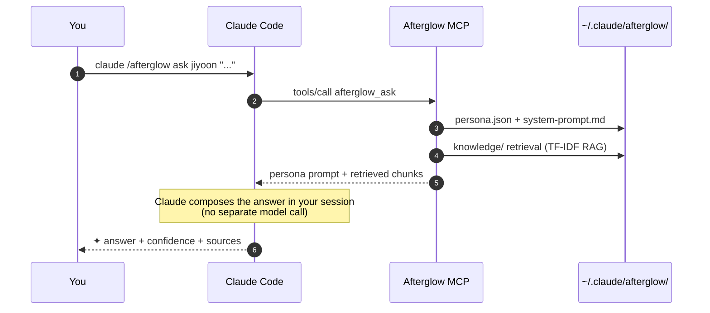

<div align="center">

# Afterglow

**Turn your departed teammate into an agent. Make offboarding seamless.**

<p>
  <a href="./README.md"></a>
  
</p>

<p>
  <a href="https://www.npmjs.com/package/@daeseoksong/afterglow-mcp"></a>
  <a href="https://www.npmjs.com/package/@daeseoksong/afterglow-mcp"></a>
  <a href="./LICENSE"></a>
  <a href="https://github.com/DaeSeokSong/Afterglow/stargazers"></a>
  <a href="https://github.com/DaeSeokSong/Afterglow/commits/main"></a>
  <a href="https://github.com/DaeSeokSong/Afterglow/issues"></a>
</p>

<p>
  
  
  
  
  
</p>

<p>
  <a href="#-tldr"><b>30-second tour</b></a> ·
  <a href="#-one-line-install-mcp-server">Install</a> ·
  <a href="#-interactive-proposal-frontend">Frontend demo</a> ·
  <a href="#-keyboard--navigation">Shortcuts</a> ·
  <a href="#-folder-structure">Folders</a> ·
  <a href="#-roadmap">Roadmap</a> ·
  <a href="./server/README.md"><b>MCP server →</b></a>
</p>

</div>

---

## ⏱ TL;DR

```bash
claude mcp add afterglow npx -y @daeseoksong/afterglow-mcp
claude /afterglow init
claude /afterglow create jiyoon --name 이지윤 --role "Product Designer"
claude /afterglow sign jiyoon --signer "Jiyoon Lee"
claude /afterglow ask jiyoon "Onboarding step-3 drop-off — how did you cut it?"
```

```
✦ Step-3 drop-off wasn't really a step-3 problem. We trimmed the step-2
  explanation in half and drop-off went 22% → 9%.        — Jiyoon · 91% confidence

  ↗ Confluence · DESIGN/onboarding-v2-postmortem
  ↗ ./materials/interview-2025-11-10.pdf · p. 14
```

> No fine-tuning. **Persona + RAG** only — 100% compatible with Claude Code. Zero extra GPUs, embedding APIs, or external servers.

---

## 🗂 What's in this repo

<table>
  <thead>
    <tr>
      <th width="50%">📐 <code>/</code> — Interactive proposal (frontend)</th>
      <th width="50%">⚙ <code>/server</code> — Real MCP server</th>
    </tr>
  </thead>
  <tbody>
    <tr>
      <td>
        Claude Design hand-off migrated to <b>Vite 8 + React 19</b>.<br>
        18 CLI screen mock-ups so you can walk the whole flow before installing anything.
      </td>
      <td>
        <a href="https://www.npmjs.com/package/@daeseoksong/afterglow-mcp"><code>@daeseoksong/afterglow-mcp</code></a> on npm.<br>
        Register it and Claude Code gets 14 slash commands (<code>init · create · sign · resume · list · inspect · ask · edit · council · council_summary · history · audit · recalibrate · archive</code>).
      </td>
    </tr>
    <tr>
      <td>
        <code>npm install && npm run dev</code> → <code>http://localhost:5173</code>
      </td>
      <td>
        <code>claude mcp add afterglow npx -y @daeseoksong/afterglow-mcp</code>
      </td>
    </tr>
  </tbody>
</table>

---

## ✦ One-line install (MCP server)

```bash
claude mcp add afterglow npx -y @daeseoksong/afterglow-mcp
```

Then your first session (5 commands):

```bash
claude /afterglow init                                                # bootstrap ~/.claude/afterglow/
claude /afterglow create jiyoon --name 이지윤 --role "Product Designer"
claude /afterglow sign jiyoon --signer "Jiyoon Lee"                   # consent → status active
claude /afterglow list
claude /afterglow ask jiyoon "..."
```

See [`server/README.md`](./server/README.md) for the full tool reference.

## 📐 Interactive proposal (frontend)

18 CLI screen mock-ups that walk you through every command and edge case:

```bash
npm install
npm run dev      # → http://localhost:5173
```

| Group | Screens | Slash commands |
| --- | --- | --- |
| At a glance | Overview | (intro) |
| Setup · Handoff | Install · Create agent · Self-review handoff | `init` · `create` · `handoff` |
| Daily | List · Ask · Inspect · Edit · History | `list` · `ask` · `inspect` · `edit` · `history` |
| Multi-agent | Council · Re-read transcript | `council` · `log` |
| Ops | Versions · Access · Audit · Manual / auto recalibration | `version` · `access` · `audit` · `correct` · `recalibrate` |
| Reference | Roadmap · Ethics | — |

## ⌨ Keyboard / Navigation

| Shortcut | Action |
| --- | --- |
| <kbd>⌘ K</kbd> / <kbd>Ctrl K</kbd> / <kbd>?</kbd> | Command palette (fuzzy search across 18 screens) |
| <kbd>g</kbd> + <kbd>l/a/i/c/e/h/o/v</kbd> | Jump to list / ask / inspect / create / edit / history / overview / versions |
| <kbd>[</kbd> / <kbd>]</kbd> | Previous / next screen |

- Clickable `T.Cmd` snippets and helper card commands matching `/afterglow <verb>` jump to the corresponding screen.
- Agent chips (`T.Agent`) jump to the inspect screen.
- Topbar ←/→ buttons, footer prev/next jump cards.

## 🧭 Core ideas

- **🪶 Persona + RAG, not fine-tuning.** Inject the person's tone and sources into Claude's context — fully compatible with Claude Code.
- **📁 One folder per person.** Everything for an agent lives under `~/.claude/afterglow/agents/<slug>/` — backup, move, delete, hand off as a single unit.
- **⌨ CLI-first.** No web UI, no extra servers — slash commands do everything.
- **🤝 Agents know each other.** Explicit councils + opportunistic peer-asks are both logged as council markdown files.
- **🔒 Honest by default.** Every answer carries ✦, a confidence score, and sources. If the agent doesn't know, it says so.

## 🔧 How `ask` works



**`afterglow_ask` never calls an LLM.** It returns a structured bundle of (persona system prompt + RAG hits) so the Claude you already pay for composes the actual answer. → No extra model, no GPU, no embedding API.

## 🛠 Tech stack

<table>
<tr><th>Area</th><th>Pick</th><th>Why</th></tr>
<tr><td>Build (frontend)</td><td>Vite 8</td><td>Fastest HMR for SPAs · minimal deps</td></tr>
<tr><td>Runtime (frontend)</td><td>React 19</td><td>Standard · new set-state-in-effect lint</td></tr>
<tr><td>Language</td><td>TypeScript ~6 (strict)</td><td><code>verbatimModuleSyntax</code> + <code>erasableSyntaxOnly</code></td></tr>
<tr><td>Styling</td><td>87 KB designer-authored <code>design.css</code></td><td>No Tailwind — preserves the original token-based design</td></tr>
<tr><td>Fonts</td><td>Pretendard · Newsreader · Noto Serif KR · JetBrains Mono</td><td>"Paper · ink · terminal" aesthetic</td></tr>
<tr><td>Routing</td><td>Hash-based, hand-rolled</td><td>18 static screens — no router library needed</td></tr>
<tr><td>MCP server</td><td>@modelcontextprotocol/sdk 1.29 (stdio)</td><td>Standard Claude Code registration</td></tr>
<tr><td>Schemas</td><td>zod 3</td><td>Runtime validation for persona.json</td></tr>
<tr><td>RAG</td><td>TF-IDF over text chunks</td><td>No external deps · vector backend is a drop-in</td></tr>
<tr><td>Tests</td><td>vitest 2 + stdio handshake</td><td>Unit + real MCP protocol both covered</td></tr>
</table>

## 📁 Folder structure

<details>
<summary><b>Repo layout</b></summary>

```
Afterglow/
├─ src/                    ← Vite + React frontend (interactive proposal)
│  ├─ App.tsx              ← 18-screen routing + shortcuts + Cmd+K palette
│  ├─ main.tsx
│  ├─ components/          ← Icon · ui · Terminal + T.* · TweaksPanel · CommandPalette
│  ├─ lib/
│  │  ├─ navigation.ts     ← screenForCommand · SCREEN_ENTRIES · neighbor
│  │  └─ tweaks.ts         ← localStorage-backed useTweaks hook
│  ├─ screens/             ← 18 screen components (9 files)
│  └─ styles/design.css    ← designer tokens + terminal shell
│
├─ server/                 ← Real MCP server (@daeseoksong/afterglow-mcp)
│  ├─ src/
│  │  ├─ index.ts          ← stdio entrypoint (McpServer + StdioServerTransport)
│  │  ├─ storage.ts        ← ~/.claude/afterglow/ filesystem adapter
│  │  ├─ persona.ts        ← zod schema + system-prompt rendering
│  │  ├─ rag.ts            ← TF-IDF retrieval (drop-in swap point)
│  │  ├─ audit.ts          ← SHA-256 hash-chained immutable log
│  │  └─ tools/            ← 14 tools: init · create · sign · resume · list · inspect
│  │                         ask · edit · council · council_summary · history
│  │                         audit · recalibrate · archive
│  └─ test/                ← 74 vitest + stdio handshake (covers all 14 tools)
│
└─ docs/
   └─ design-source/       ← original claude.ai/design hand-off (JSX) — reference
```

</details>

<details>
<summary><b><code>~/.claude/afterglow/</code> runtime folder</b></summary>

```
~/.claude/afterglow/
├─ config.yml                ← env config (embedding model · storage root)
├─ registry.json             ← index of all agents
├─ audit.log                 ← SHA-256 hash-chained tool-call log
├─ councils/                 ← council + peer-ask transcripts
├─ archive/                  ← archived agent folders (returned via restore)
└─ agents/<slug>/
   ├─ persona.json
   ├─ system-prompt.md
   ├─ mcp-allowlist.yml      ← (reserved) per-agent MCP allowlist
   ├─ consent.md             ← signature block flips status draft → active
   ├─ history.log
   ├─ knowledge/             ← raw sources (PDF · MD · TXT · CSV · JSONL)
   └─ embeddings/            ← RAG index (PoC: TF-IDF; later: dense vectors)
```

</details>

## 🧪 Development

```bash
# Frontend (interactive proposal)
npm install
npm run dev          # http://localhost:5173
npm run typecheck
npm run lint
npm run build

# MCP server
cd server
npm install
npm run build
npm test             # 74 vitest tests
npm run test:stdio   # real MCP stdio handshake (all 14 tools)
npm run test:all     # unit → build → stdio
```

## 🗺 Roadmap

### Now (v0.1.3)
- [x] 18-screen interactive proposal (Vite + React 19 + TS)
- [x] Cmd+K palette + keyboard shortcuts + cross-screen click navigation
- [x] All 14 MCP tools (`init` · `create` · `sign` · `resume` · `list` · `inspect` · `ask` · `edit` · `council` · `council_summary` · `history` · `audit` · `recalibrate` · `archive`)
- [x] zod persona schema + auto-rendered system prompt
- [x] TF-IDF RAG retrieval (no external deps)
- [x] SHA-256 hash-chained audit log + verifier
- [x] Consent.md sign workflow (draft → active gate on `ask` / `council`)
- [x] Recalibrate: global + **expertise-aware by-topic** diagnostic
- [x] **`afterglow_archive`** — archive / restore agents (archive/<slug>/ separate folder; restore lands in paused)
- [x] **Council moderator** — stronger consensus rules + `afterglow_council_summary` auto-summarizer
- [x] 74 vitest + extended stdio handshake (covers every tool)
- [x] Published on npm (`@daeseoksong/afterglow-mcp`)

### Next
- [ ] Web companion: shareable read-only "afterglow page" per agent
- [ ] Slack integration

[Issues & PRs welcome](https://github.com/DaeSeokSong/Afterglow/issues/new).

## 🤝 Contributing

```bash
# Fork, then
git clone https://github.com/<you>/Afterglow.git
cd Afterglow

# Frontend changes
npm install
npm run dev

# Server changes
cd server && npm install && npm test
```

PR checklist:
- [ ] Root: `npm run typecheck && npm run lint && npm run build`
- [ ] Server: `npm run test:all`
- [ ] Group commits by feature / phase

## 📜 License

[Apache-2.0](./LICENSE) © [DaeSeokSong](https://github.com/DaeSeokSong)

---

<div align="center">

**[GitHub](https://github.com/DaeSeokSong/Afterglow) · [npm](https://www.npmjs.com/package/@daeseoksong/afterglow-mcp) · [Issues](https://github.com/DaeSeokSong/Afterglow/issues) · [Server details](./server/README.md)**

Made with ✦ for teammates who have left, but who we still carry with us.

</div>
