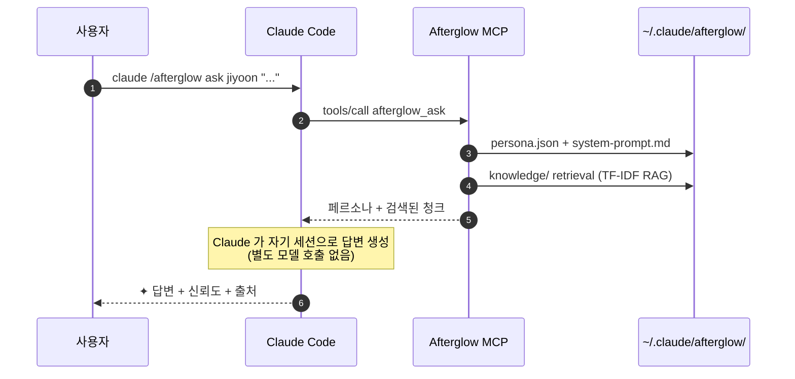

<div align="center">

# Afterglow

**퇴사한 동료를 에이전트로 만들어서 퇴사 후 인수인계를 수월하게 하세요**

<p>
  
  <a href="./README.en.md"></a>
</p>

<p>
  <a href="https://www.npmjs.com/package/@daeseoksong/afterglow-mcp"></a>
  <a href="https://www.npmjs.com/package/@daeseoksong/afterglow-mcp"></a>
  <a href="./LICENSE"></a>
  <a href="https://github.com/DaeSeokSong/Afterglow/stargazers"></a>
  <a href="https://github.com/DaeSeokSong/Afterglow/commits/main"></a>
  <a href="https://github.com/DaeSeokSong/Afterglow/issues"></a>
</p>

<p>
  
  
  
  
  
</p>

<p>
  <a href="#-tldr"><b>30초 요약</b></a> ·
  <a href="#-한-줄-설치-mcp-서버">설치</a> ·
  <a href="#-인터랙티브-제안서-프론트">디자인 모킹</a> ·
  <a href="#-키보드--네비게이션">단축키</a> ·
  <a href="#-폴더-구조">폴더 구조</a> ·
  <a href="#-roadmap">로드맵</a> ·
  <a href="./server/README.md"><b>MCP 서버 →</b></a>
</p>

</div>

---

## ⏱ TL;DR

```bash
claude mcp add afterglow npx -y @daeseoksong/afterglow-mcp
claude /afterglow init
claude /afterglow create jiyoon --name 이지윤 --role "프로덕트 디자이너"
claude /afterglow sign jiyoon --signer "이지윤"
claude /afterglow ask jiyoon "온보딩 step 3 이탈, 어떻게 줄였어요?"
```

```
✦ step 3 이탈은 사실 step 3 잘못이 아니었어요. step 2 설명을 절반으로
  줄였더니 22% → 9%로 떨어졌어요.                — 이지윤 · 신뢰도 91%

  ↗ Confluence · DESIGN/onboarding-v2-postmortem
  ↗ ./materials/interview-2025-11-10.pdf · p. 14
```

> 모델 fine-tune 없이 **페르소나 + RAG** 만으로 Claude Code 와 100% 호환. 추가 GPU · 임베딩 API · 외부 서버 0원.

---

## 🗂 이 저장소는 두 부분으로 구성됩니다

<table>
  <thead>
    <tr>
      <th width="50%">📐 <code>/</code> 인터랙티브 제안서 (프론트)</th>
      <th width="50%">⚙ <code>/server</code> 실제 MCP 서버</th>
    </tr>
  </thead>
  <tbody>
    <tr>
      <td>
        Claude Design 핸드오프 → <b>Vite 8 + React 19</b> 마이그레이션.<br>
        18 개의 CLI 화면 모킹으로 전체 시스템 흐름을 사용자에게 보여주는 인터랙티브 데모.
      </td>
      <td>
        <a href="https://www.npmjs.com/package/@daeseoksong/afterglow-mcp"><code>@daeseoksong/afterglow-mcp</code></a> npm 패키지.<br>
        Claude Code에 등록하면 <code>init · create · handoff · sign · resume · list · inspect · ask · edit · council · council_summary · history · audit · recalibrate · correct · archive · version · access · interview · export · import · verify · status · gc</code> 24 개 슬래시 명령이 동작.
      </td>
    </tr>
    <tr>
      <td>
        <code>npm install && npm run dev</code> → <code>http://localhost:5173</code>
      </td>
      <td>
        <code>claude mcp add afterglow npx -y @daeseoksong/afterglow-mcp</code>
      </td>
    </tr>
  </tbody>
</table>

---

## ✦ 한 줄 설치 (MCP 서버)

```bash
claude mcp add afterglow npx -y @daeseoksong/afterglow-mcp
```

이어서 첫 사용 (5 줄):

```bash
claude /afterglow init                                                # ~/.claude/afterglow/ 부트스트랩
claude /afterglow create jiyoon --name 이지윤 --role "프로덕트 디자이너"
claude /afterglow sign jiyoon --signer "이지윤"                        # consent.md 서명 → status active (ask 가능)
claude /afterglow list
claude /afterglow ask jiyoon "..."
```

자세한 내용은 [`server/README.md`](./server/README.md) 참고.

> **참고 — 두 가지 호출 방식.** Afterglow 는 MCP 서버라 도구는 실제로 `afterglow_handoff({slug:"jiyoon", action:"start"})` 같은 JSON 호출입니다. 두 가지로 부를 수 있어요:
> 1. **자연어** — "afterglow 초기화해줘" 처럼 말하면 Claude 가 알맞은 도구를 호출합니다.
> 2. **슬래시 명령** — Claude Code 입력창에서 **`/mcp__afterglow__<이름>`** (예: `/mcp__afterglow__init`, `/mcp__afterglow__ask`)으로 직접 호출 + 인자 자동완성. (MCP prompt로 노출 — 형식이 `/afterglow init` 이 아니라 `/mcp__afterglow__init` 인 점만 유의)
>
> 본 README 의 `claude /afterglow …` 표기는 가독성을 위한 약식이며, 실제로는 위 두 방식 중 하나로 쓰시면 됩니다.

### ⌨ 슬래시 명령 예시 (`/mcp__afterglow__*`)

Claude Code 입력창에 `/mcp__afterglow__` 까지 치면 자동완성 목록이 뜨고, 선택하면 인자 칸이 나옵니다. (괄호 인자는 선택)

| 하고 싶은 것 | 슬래시 명령 | 채울 인자 | 자연어 대안 |
| --- | --- | --- | --- |
| 초기화 | `/mcp__afterglow__init` | (없음) | "afterglow 초기화해줘" |
| 에이전트 생성 | `/mcp__afterglow__create` | `slug` `name` `role` (`tenure` `bio`) | "jiyoon 에이전트 만들어줘, 이지윤 프로덕트 디자이너" |
| 서명 → active | `/mcp__afterglow__sign` | `slug` `signer` | "jiyoon 을 이지윤 이름으로 서명" |
| 목록 | `/mcp__afterglow__list` | (`status`) | "afterglow 목록 보여줘" |
| 전체 대시보드 | `/mcp__afterglow__status` | (없음) | "afterglow 상태 알려줘" |
| 상세 보기 | `/mcp__afterglow__inspect` | `slug` | "jiyoon 상세 보여줘" |
| 질문 | `/mcp__afterglow__ask` | `slug` `question` | "jiyoon 에게 결제 fallback 어떻게 했는지 물어봐" |
| 본인 인계 | `/mcp__afterglow__handoff` | `slug` `action` (`signer`) | "jiyoon handoff start 해줘" |
| 다중 인터뷰 | `/mcp__afterglow__interview` | `slug` `action` (`session` `title` `interviewer`) | "jiyoon 인터뷰 시작, 제목 결제 갭, 진행자 김후임" |
| 합동 회의 | `/mcp__afterglow__council` | `slugs` `question` | "jiyoon,jaehoon 모아서 회의" |
| 내보내기 | `/mcp__afterglow__export` | `slugs` 또는 `all` | "jiyoon 내보내줘" |
| 가져오기 | `/mcp__afterglow__import` | `input` (`expectAnchor`) | "이 번들 가져와줘: ./afterglow-export-…/" |
| 정리 | `/mcp__afterglow__gc` | `action` (`slug` `apply`) | "오래된 스냅샷 정리 미리보기" |
| 재활성화 | `/mcp__afterglow__resume` | `slug` | "jiyoon 다시 활성화" |

**예시 흐름** (슬래시):
```text
/mcp__afterglow__init
/mcp__afterglow__create     → slug: jiyoon · name: 이지윤 · role: 프로덕트 디자이너
/mcp__afterglow__sign       → slug: jiyoon · signer: 이지윤
/mcp__afterglow__ask        → slug: jiyoon · question: 온보딩 step 3 이탈 어떻게 줄였어요?
/mcp__afterglow__interview  → slug: jiyoon · action: start · title: 결제 갭 · interviewer: 김후임
```

> 인자가 많은 도구(예: interview 의 attach·answer)는 자연어가 더 편할 수 있어요. 슬래시는 자주 쓰는 진입점(init·create·ask·status 등)에 특히 유용합니다.

## 📐 인터랙티브 제안서 (프론트)

전체 시스템을 어떻게 쓰는지 한 번에 둘러보는 18 개의 CLI 화면 모킹:

```bash
npm install
npm run dev      # → http://localhost:5173
```

| 그룹 | 화면 | 슬래시 명령 |
| --- | --- | --- |
| 한눈에 | 둘러보기 | (intro) |
| 셋업 · 인계 | 처음 설치 / 에이전트 만들기 / 본인 인계 모드 | `init` · `create` · `handoff` |
| 매일 쓰는 명령 | 목록 / 질문 / 상세 / 수정 / 대화 로그 | `list` · `ask` · `inspect` · `edit` · `history` |
| 에이전트끼리 | 합동 회의 / 회의록 다시 보기 | `council` · `log` |
| 운영 · 관리 | 버전 / 권한 / 감사 / 신뢰도 수동 · 자동 | `version` · `access` · `audit` · `correct` · `recalibrate` |
| 참고 | 로드맵 / 윤리 가이드 | — |

## ⌨ 키보드 / 네비게이션

| 단축키 | 동작 |
| --- | --- |
| <kbd>⌘ K</kbd> / <kbd>Ctrl K</kbd> / <kbd>?</kbd> | 명령 팔레트 (18 화면 fuzzy 검색) |
| <kbd>g</kbd> + <kbd>l/a/i/c/e/h/o/v</kbd> | 빠른 점프 (list / ask / inspect / create / edit / history / overview / version) |
| <kbd>[</kbd> / <kbd>]</kbd> | 이전 / 다음 화면 |

- 본문의 `T.Cmd` 또는 helper card 의 `/afterglow <verb>` 스니펫 클릭 → 해당 화면으로 이동
- 에이전트 chip (`T.Agent`) 클릭 → 상세 보기로 이동
- 톱바 ←/→ 버튼, 푸터 prev/next 점프 카드

## 🙋 본인 인계 모드 — 온보딩 흐름

퇴사 1–2주 전, 본인이 자기 에이전트와 1:1 검수 세션을 엽니다 (`/afterglow handoff`).

```bash
# 1. 세션 시작 — 샘플 질문 N개 자동 생성 (또는 동료가 적어둔 questions.txt 로드)
claude /afterglow handoff jiyoon --action start --limit 12

# 2. 검수 — 각 질문에 keep / edit / decline
#    edit 은 본인이 직접 답을 적어 덮어쓰기
#    decline 은 "이 질문은 다른 에이전트에게 안내" (답하지 않기로)
claude /afterglow handoff jiyoon --action review \
  --reviews '[{"id":"q-…","action":"edit","userAnswer":"…"}, …]'

# 3. 진행 확인 (언제든)
claude /afterglow handoff jiyoon --action status

# 4. 본인 서명 + active 전환
claude /afterglow handoff jiyoon --action finalize --signer "이지윤"
```

- 본인이 작성한 edit / decline 답변은 `persona.bio` 의 `## handoff 답변` / `## 답하지 않기로 한 영역` 블록으로 흡수됨 (Claude 가 다음 ask 부터 이를 우선 인용)
- 모든 단계가 `audit.log` + `history.log` 에 hash-chained 로 기록
- 중간에 중단되면 같은 명령으로 재개. `--action abort` 로 폐기. `--sign-partial` 로 pending 남겨도 서명 강행

이 흐름은 디자인의 핵심 가치 약속을 보장합니다:
> *"본인이 동의하고 본인이 만든 디지털 자신"* — 자료에서 자동 추출된 페르소나가 본인 의도와 다를 수 있으니 검수 단계가 필수.

### 본인 인계 vs HR 대리 인계

| 경우 | 누가 서명하는가 | `--signer` 값 | 권장 흐름 |
| --- | --- | --- | --- |
| 본인이 퇴사 전 직접 검수 | 본인 | `"이지윤"` | `/afterglow handoff … --action finalize` |
| 본인 부재(이미 퇴사·연락 불가) | HR / 매니저 대리 | `"HR · 김OO (대리, 본인 부재)"` | 같은 명령. signer 문자열에 **대리** 표시 필수 |
| 동의 자체가 없음 | (서명 금지) | — | 도구 사용 불가 — `paused` 상태로만 보관 |

`afterglow_sign` / `handoff finalize` 는 `signer` 값을 **그대로 신뢰**해서 `consent.md` 와 `audit.log` 에 기록할 뿐, 본인 인증(SSO·MFA)을 수행하지 않습니다. **PoC 단계 가정**입니다: 운영 환경에 올릴 땐 SSO 토큰 / 사내 ID 검증 / HR 결재 시스템과 묶어 사용하세요.

## 🎤 추가 인터뷰 (v0.2) — 인계자가 퇴사자를 여러 번 인터뷰

`handoff` 가 퇴사자 **본인의 1회 셀프 검수**라면, `interview` 는 **인계자(인수받는 사람)가 퇴사자를 여러 회차에 걸쳐 인터뷰**하는 흐름입니다. 자료를 받아보면 꼭 추가 질문이 생기거나 퇴사자가 빠뜨린 부분이 나오니까요.

```bash
claude /afterglow interview jiyoon --action start --title "결제 갭" --interviewer "김후임" --interviewee "이지윤"
claude /afterglow interview jiyoon --action add-question --session 001-결제-갭 --question "5초 timeout 후 정책은?"
claude /afterglow interview jiyoon --action answer --session 001-결제-갭 --id q-… --answer "다음 PG 로 전환" --source voice
claude /afterglow interview jiyoon --action gap-check --session 001-결제-갭   # 빠진 부분 자동 감지 → 후속 질문 생성
claude /afterglow interview jiyoon --action attach --session 001-결제-갭 --file ./rec.mp3 --transcript ./rec.txt --speakers 이지윤,김후임
claude /afterglow interview jiyoon --action finalize --session 001-결제-갭 --signRole interviewer --signer "김후임"
claude /afterglow interview jiyoon --action finalize --session 001-결제-갭 --signRole interviewee --signer "이지윤"
```

- **갭 자동 감지** (`gap-check`): 답변을 4신호(내부모순·자료충돌·과거충돌·인접미커버)로 분석해 *"이 부분이 빠진 것 같은데 맞나요?"* 확인 질문을 생성합니다. `ask` 처럼 LLM 추가 호출 없이 컨텍스트만 묶어 Claude 가 만듭니다.
- **음성·영상 첨부** (`attach`): 원본은 보존, 전사본(`.md`/`.txt`)만 RAG 인덱싱. 오디오/비디오는 발화자(`--speakers`) 명시 필수.
- **부재 시 주석** (`--intervieweeAbsent`): 퇴사자가 이미 떠났으면 인계자가 "추정 ⚠(미확인)" 주석을 남깁니다 (퇴사자가 `handoff` 때 `--allowProxyAnnotation` 으로 사전 동의한 경우).
- **이중 서명**: 인터뷰어 + 인터뷰이 둘 다 서명해야 `finalized`. 답변은 `persona.bio` 의 `## 인터뷰 보강 #N` 블록으로 누적돼 다음 `ask` 부터 인용됩니다.

## 🔌 핫플러그 (v0.2) — 에이전트 폴더를 다른 사용자에게 넘기기

만든 에이전트를 **다른 Afterglow 사용자에게 넘기면 바로 인식**됩니다. 한 명도, 여러 명도 한 번에.

```bash
# ── 보내는 사람: 내보내기 ──
claude /afterglow export --slugs jiyoon jaehoon --exportedBy "이지윤"   # 또는 --all
#   → ./afterglow-export-<날짜>/  폴더 생성 (manifest.json + 에이전트별 무결성 해시)
#   → 폴더를 압축(tar/zip)해서 보내거나 USB·공유드라이브로 복사

# ── 받는 사람: 검증 → 가져오기 ──
claude /afterglow verify  ./afterglow-export-…/                         # 읽기 전용 사전 점검
claude /afterglow import  ./afterglow-export-…/ --importedBy "김후임" --from "이지윤" --trustSigner "이지윤"
#   → 서명된 에이전트는 active, 미서명은 paused 로 자동 등록
```

import 가 자동으로 검증하는 것: **스키마**(zod) · **무결성 해시**(변조 시 거부, `--acceptBrokenChain` 으로만 강행) · **서명 유무** · **심볼릭링크 차단**(`~/.ssh` 류 공격 방지) · **프롬프트 인젝션 스캔**. 출처는 `provenance.json` 에 기록되어 이후 `ask` 답변에 "외부 import" 배지가 붙습니다. slug 충돌은 `--as <새-slug>` 또는 `--merge`(인터뷰 회차만 합치기). 번들이 아니라 `agents/<slug>/` 폴더 하나만 받아도 import 됩니다.

> **처음 써보세요?** [`docs/afterglow-hands-on.ipynb`](./docs/afterglow-hands-on.ipynb) 핸즈온 노트북이 설치 → 생성 → 인터뷰 → export/import 까지 복붙으로 따라 할 수 있게 안내합니다.

## 🧭 핵심 컨셉

- **🪶 학습이 아니라 페르소나 + RAG.** Claude의 컨텍스트에 톤과 자료를 함께 주입 — fine-tune 없이 Claude Code 와 100% 호환.
- **📁 한 폴더에 한 사람.** `~/.claude/afterglow/agents/<slug>/` 안에 `persona.json` · `system-prompt.md` · `knowledge/` · `embeddings/` · `consent.md` · `history.log`.
- **⌨ 모든 작업은 CLI.** 웹 UI 없이 슬래시 명령으로 끝납니다.
- **🤝 서로 알고, 서로 답합니다.** 명시적 회의(council) · 답변 도중 자발적 협의(peer-ask) 모두 회의록으로 저장.
- **🔒 가짜인 척하지 않습니다.** 모든 답변에 ✦ 마크 + 신뢰도 + 출처가 함께.

## 🔧 동작 원리



**`afterglow_ask` 는 LLM 을 호출하지 않습니다.** 페르소나 system-prompt + RAG 결과를 구조화된 텍스트로 묶어 반환하면, Claude Code 가 자기 컨텍스트로 직접 답변을 생성합니다. → 추가 모델 / GPU / 임베딩 API 0원.

> **PoC 한계 — RAG 인덱스 범위.** 현재 RAG는 `knowledge/` 안의 텍스트 형태(`.md` · `.txt` · `.csv` · `.jsonl`) 만 인덱싱합니다. **PDF 는 자동 파싱하지 않습니다.** PDF/PPT 자료는 외부 추출 후 `.md` / `.txt` 로 변환해 넣어주세요. (`pdftotext file.pdf -` 등). 자료 크기는 항목별 약 4MB 이하를 권장.

## 🛠 기술 스택

<table>
<tr><th>영역</th><th>선택</th><th>이유</th></tr>
<tr><td>빌드 (프론트)</td><td>Vite 8</td><td>SPA에 가장 빠른 HMR · 의존성 최소</td></tr>
<tr><td>런타임 (프론트)</td><td>React 19</td><td>표준 + 새 set-state-in-effect lint</td></tr>
<tr><td>언어</td><td>TypeScript ~6 (strict)</td><td><code>verbatimModuleSyntax</code> + <code>erasableSyntaxOnly</code></td></tr>
<tr><td>스타일</td><td>디자이너 작성 87KB <code>design.css</code></td><td>Tailwind 미도입 — 토큰 기반 커스텀 디자인 보존</td></tr>
<tr><td>폰트</td><td>Pretendard · Newsreader · Noto Serif KR · JetBrains Mono</td><td>"한지·잉크·터미널" 컨셉</td></tr>
<tr><td>라우팅</td><td>hash 기반 자체 구현</td><td>18 화면 정적 SPA — 외부 라우터 불필요</td></tr>
<tr><td>MCP 서버</td><td>@modelcontextprotocol/sdk 1.29 (stdio)</td><td>Claude Code 표준 등록 방식</td></tr>
<tr><td>스키마</td><td>zod 3</td><td>persona.json 런타임 검증</td></tr>
<tr><td>테스트</td><td>vitest 2 + stdio 핸드셰이크</td><td>단위 + 실제 MCP 프로토콜 모두 검증</td></tr>
</table>

## 📁 폴더 구조

<details>
<summary><b>저장소 전체</b></summary>

```
Afterglow/
├─ src/                    ← Vite + React 프론트 (인터랙티브 제안서)
│  ├─ App.tsx              ← 18 화면 라우팅 + 단축키 + Cmd+K 팔레트
│  ├─ main.tsx
│  ├─ components/          ← Icon · ui · Terminal + T.* · TweaksPanel · CommandPalette
│  ├─ lib/
│  │  ├─ navigation.ts     ← screenForCommand · SCREEN_ENTRIES · neighbor
│  │  └─ tweaks.ts         ← localStorage 백킹 useTweaks 훅
│  ├─ screens/             ← 18 개 화면 컴포넌트 (9 파일)
│  └─ styles/design.css    ← 디자이너 작성 토큰 + 터미널 셸
│
├─ server/                 ← 실제 MCP 서버 (@daeseoksong/afterglow-mcp)
│  ├─ src/
│  │  ├─ index.ts          ← stdio 진입점 (McpServer + StdioServerTransport)
│  │  ├─ storage.ts        ← ~/.claude/afterglow/ 파일시스템 어댑터 + consent gate
│  │  ├─ persona.ts        ← zod schema + 시스템 프롬프트 렌더링
│  │  ├─ rag.ts            ← TF-IDF chunk retrieval (knowledge/ + 인터뷰 전사본)
│  │  ├─ interview.ts      ← 인터뷰/첨부/서명/provenance 스키마
│  │  ├─ portable.ts       ← 번들 manifest + 해시 + 인젝션 스캔
│  │  ├─ audit.ts          ← SHA-256 hash-chained immutable log
│  │  └─ tools/            ← 24 도구: …+ interview · export · import · verify · status · gc
│  └─ test/                ← vitest 208 + stdio 핸드셰이크 (24 도구)
│
└─ docs/
   └─ design-source/       ← claude.ai/design 핸드오프 원본 (JSX) — 참조용
```

</details>

<details>
<summary><b><code>~/.claude/afterglow/</code> 런타임 폴더</b></summary>

```
~/.claude/afterglow/
├─ config.yml                ← 환경 설정 (embedding model · storage root)
├─ registry.json             ← 전체 에이전트 인덱스
├─ audit.log                 ← SHA-256 hash-chained 도구 호출 로그
├─ councils/                 ← council + peer-ask 회의록
├─ archive/                  ← 보관(archive)된 에이전트 폴더 (restore 시 복귀)
└─ agents/<slug>/
   ├─ persona.json
   ├─ system-prompt.md
   ├─ mcp-allowlist.yml      ← (예약) 에이전트별 MCP 권한
   ├─ consent.md             ← 서명 → status draft → active 전환
   ├─ history.log
   ├─ access.json            ← 호출 권한 정책 (afterglow_access)
   ├─ handoff.json           ← 본인 인계 세션 (afterglow_handoff)
   ├─ followup.json          ← 추가 인터뷰 사전 동의 (handoff → interview 브릿지)
   ├─ provenance.json        ← 출처·신뢰도·전달 이력 (afterglow_import 시 기록)
   ├─ corrections.log        ← 사용자 보정 누적 (afterglow_correct)
   ├─ .versions/             ← persona 스냅샷 (afterglow_version)
   ├─ interviews/            ← 다중 인터뷰 (afterglow_interview)
   │  ├─ index.json          ← 회차 인덱스
   │  └─ <NNN-제목>/session.json + attachments/ (음성·영상 + 전사본)
   ├─ knowledge/             ← 원본 자료 (PDF · MD · TXT · CSV · JSONL)
   └─ embeddings/            ← RAG 인덱스 (PoC: TF-IDF, 추후 dense vector)
```

</details>

## 🧪 개발

```bash
# 프론트 (인터랙티브 제안서)
npm install
npm run dev          # http://localhost:5173
npm run typecheck
npm run lint
npm run build

# MCP 서버
cd server
npm install
npm run build
npm test             # 135 vitest tests
npm run test:stdio   # 실제 MCP stdio 핸드셰이크 (18 도구 전체)
npm run test:all     # 전체 (unit → build → stdio)
```

## ⚠ Known PoC limits

Afterglow v0.2.0 은 **PoC 단계**입니다. 운영 배포 전 알아두면 좋은 한계:

| 영역 | 현재 동작 | 운영 시 보완 |
| --- | --- | --- |
| **본인 인증** | `signer` 값 그대로 기록 (SSO/MFA 없음) | HR 결재 시스템 / SSO 토큰과 묶어 사용 |
| **RAG 인덱싱** | `.md`/`.txt`/`.csv`/`.jsonl` 만 — PDF/PPT 미지원 | 외부 추출 후 `.md` 로 변환 |
| **`audit.log` 스케일** | 매 verify 마다 전체 read + 해시 재계산 | 수만 줄 누적 시 분할 / 체크포인트 필요 |
| **`.versions/` 보존** | 모든 edit/sign/handoff/rollback 이 영구 스냅샷 | 정기적 수동 정리 (`rm` + `tags.json` 동기화) |
| **`afterglow_correct` 권한** | `access.json` 은 `ask` 에만 적용 — correct 는 무차별 호출 | 운영 시 wrapper 로 per-tool ACL 추가 |
| **GDPR 삭제** | `archive` 는 `archive/<slug>/` 로 이동만 — 실제 삭제 아님 | 만료 후 수동 `rm -rf` + registry 정리 |
| **다중 프로세스** | in-process lock 만 — 단일 stdio 서버 가정 | 분산 운영 시 외부 mutex (Redis/DB) 필요 |
| **사이드 로그 무결성** | `audit.log` 만 해시 체인 — `history.log` / `consent.md` 등은 평문 | 운영 시 sibling 파일도 audit meta 에 해시 |
| **미디어 자동 전사** | Tier 0(직접 전사본)만 내장 — 음성→텍스트 STT 미내장 | 로컬 whisper.cpp(Tier 1)/외부 STT(Tier 2) 옵트인 |
| **import 신뢰** | 이름 대조 + 폴더 해시 + 인젝션 스캔 (PoC) | 서명자 PKI / 사내 ID 검증과 묶어 사용 |

이 모두는 PoC 의 의도된 trade-off 이며, 진짜 운영하려면 별도 환경에서 보완해야 합니다.

## 🗺 Roadmap

### 현재 (v0.3.0)
- [x] 18 화면 인터랙티브 제안서 (Vite + React 19 + TS)
- [x] Cmd+K 팔레트 + 키보드 단축키 + 화면 간 클릭 네비
- [x] **MCP 서버 24 도구**: `init` · `create` · `handoff` · `sign` · `resume` · `list` · `inspect` · `ask` · `edit` · `council` · `council_summary` · `history` · `audit` · `recalibrate` · `correct` · `archive` · `version` · `access` · **`interview`** · **`export`** · **`import`** · **`verify`** · **`status`** · **`gc`**
- [x] persona zod schema + 시스템 프롬프트 자동 렌더링
- [x] **TF-IDF RAG** (외부 의존성 0 · 키워드 매칭 대비 정확도 ↑) — `knowledge/` + 인터뷰 전사본
- [x] **SHA-256 hash-chained 감사 로그** + 무결성 검증
- [x] **consent.md 서명 워크플로우** (draft → active 게이트, ask/council 보호)
- [x] **신뢰도 자동 보정** (전역 + **expertise-aware by-topic** 진단)
- [x] **`afterglow_archive`** — 에이전트 보관 / 복원 (archive/<slug>/ 별도 폴더, restore는 paused 상태로)
- [x] **Council moderator** — 강화된 합의 감지 규칙 + `afterglow_council_summary` 자동 요약 도구
- [x] **다중 인터뷰** (`afterglow_interview`) — 인계자 주도 N회차 + **갭 자동 감지** + **음성·영상 첨부** + 이중 서명. handoff(본인 셀프검수)와 분리
- [x] **핫플러그** (`afterglow_export · import · verify`) — 다중 에이전트 번들 이식 + 무결성 해시 · 프롬프트 인젝션 스캔 · 심볼릭링크 차단 · `provenance` 출처 추적
- [x] **전체 대시보드** (`afterglow_status`) + **보존/정리** (`afterglow_gc` — 스냅샷 prune · 미디어 purge · 보관함 영구삭제)
- [x] **전사** (`interview transcribe` — 로컬 whisper `--apply` / Claude polish `--text`) + **회차 전 질문 제안** (`suggest-questions`) + **검토 후 인덱싱** (`review`)
- [x] **import `--expectAnchor`** (번들 위변조 탐지) + **audit checkpoint/fast** (대용량 증분 검증)
- [x] **BM25 RAG 랭킹** + opt-in **dense-vector 백엔드** (`AFTERGLOW_RAG_BACKEND=dense` · embeddings/ 캐시 · 실패 시 렉시컬 fallback)
- [x] **whisper 모델 관리** (`transcribe --download/--list-models` + 자동 해석)
- [x] **슬래시 명령** `/mcp__afterglow__<이름>` — MCP prompt 14종으로 입력창에서 직접 호출
- [x] vitest 208개 + stdio 핸드셰이크 (24 도구 + prompts 검증)
- [x] npm 퍼블리시 (`@daeseoksong/afterglow-mcp`)
- [x] **핸즈온 Jupyter 노트북** ([`docs/afterglow-hands-on.ipynb`](./docs/afterglow-hands-on.ipynb)) — 초보자용 전 기능 따라하기

### 다음
- [ ] whisper.cpp WASM 엔진 번들 (모델 lazy-download 까지 완전 자동)
- [ ] per-tool ACL · 정기 retention 자동화 · Web companion

[기여 환영](https://github.com/DaeSeokSong/Afterglow/issues/new) — 이슈 / PR / 사용 사례 모두 좋아요.

## 🤝 Contributing

```bash
# fork 후
git clone https://github.com/<your>/Afterglow.git
cd Afterglow

# 프론트 변경
npm install
npm run dev

# 서버 변경
cd server && npm install && npm test
```

PR 전 체크:
- [ ] 루트: `npm run typecheck && npm run lint && npm run build`
- [ ] 서버: `npm run test:all`
- [ ] 의미 있는 단위 (Phase / 기능별)로 commit

## 📜 License

[Apache-2.0](./LICENSE) © [DaeSeokSong](https://github.com/DaeSeokSong)

---

<div align="center">

**[GitHub](https://github.com/DaeSeokSong/Afterglow) · [npm](https://www.npmjs.com/package/@daeseoksong/afterglow-mcp) · [Issues](https://github.com/DaeSeokSong/Afterglow/issues) · [MCP 서버 상세](./server/README.md)**

Made with ✦ for 퇴사하셨지만 아직 우리 곁에 있는 동료들에게.

</div>
