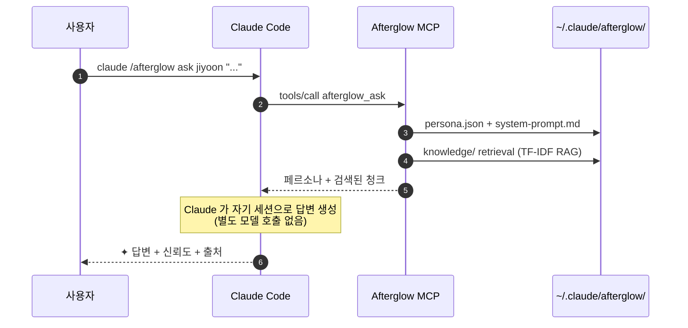

<div align="center">

# Afterglow

**퇴사한 동료를 에이전트로 만들어서 퇴사 후 인수인계를 수월하게 하세요**

<p>
  
  <a href="./README.en.md"></a>
</p>

<p>
  <a href="https://www.npmjs.com/package/@daeseoksong/afterglow-mcp"></a>
  <a href="https://www.npmjs.com/package/@daeseoksong/afterglow-mcp"></a>
  <a href="./LICENSE"></a>
  <a href="https://github.com/DaeSeokSong/Afterglow/stargazers"></a>
  <a href="https://github.com/DaeSeokSong/Afterglow/commits/main"></a>
  <a href="https://github.com/DaeSeokSong/Afterglow/issues"></a>
</p>

<p>
  
  
  
  
  
</p>

<p>
  <a href="#-tldr"><b>30초 요약</b></a> ·
  <a href="#-한-줄-설치-mcp-서버">설치</a> ·
  <a href="#-인터랙티브-제안서-프론트">디자인 모킹</a> ·
  <a href="#-키보드--네비게이션">단축키</a> ·
  <a href="#-폴더-구조">폴더 구조</a> ·
  <a href="#-roadmap">로드맵</a> ·
  <a href="./server/README.md"><b>MCP 서버 →</b></a>
</p>

</div>

---

## ⏱ TL;DR

```bash
claude mcp add afterglow npx -y @daeseoksong/afterglow-mcp
claude /afterglow init
claude /afterglow create jiyoon --name 이지윤 --role "프로덕트 디자이너"
claude /afterglow sign jiyoon --signer "이지윤"
claude /afterglow ask jiyoon "온보딩 step 3 이탈, 어떻게 줄였어요?"
```

```
✦ step 3 이탈은 사실 step 3 잘못이 아니었어요. step 2 설명을 절반으로
  줄였더니 22% → 9%로 떨어졌어요.                — 이지윤 · 신뢰도 91%

  ↗ Confluence · DESIGN/onboarding-v2-postmortem
  ↗ ./materials/interview-2025-11-10.pdf · p. 14
```

> 모델 fine-tune 없이 **페르소나 + RAG** 만으로 Claude Code 와 100% 호환. 추가 GPU · 임베딩 API · 외부 서버 0원.

---

## 🗂 이 저장소는 두 부분으로 구성됩니다

<table>
  <thead>
    <tr>
      <th width="50%">📐 <code>/</code> 인터랙티브 제안서 (프론트)</th>
      <th width="50%">⚙ <code>/server</code> 실제 MCP 서버</th>
    </tr>
  </thead>
  <tbody>
    <tr>
      <td>
        Claude Design 핸드오프 → <b>Vite 8 + React 19</b> 마이그레이션.<br>
        18 개의 CLI 화면 모킹으로 전체 시스템 흐름을 사용자에게 보여주는 인터랙티브 데모.
      </td>
      <td>
        <a href="https://www.npmjs.com/package/@daeseoksong/afterglow-mcp"><code>@daeseoksong/afterglow-mcp</code></a> npm 패키지.<br>
        Claude Code에 등록하면 <code>init · create · sign · resume · list · inspect · ask · edit · council · council_summary · history · audit · recalibrate · archive</code> 14 개 슬래시 명령이 동작.
      </td>
    </tr>
    <tr>
      <td>
        <code>npm install && npm run dev</code> → <code>http://localhost:5173</code>
      </td>
      <td>
        <code>claude mcp add afterglow npx -y @daeseoksong/afterglow-mcp</code>
      </td>
    </tr>
  </tbody>
</table>

---

## ✦ 한 줄 설치 (MCP 서버)

```bash
claude mcp add afterglow npx -y @daeseoksong/afterglow-mcp
```

이어서 첫 사용 (5 줄):

```bash
claude /afterglow init                                                # ~/.claude/afterglow/ 부트스트랩
claude /afterglow create jiyoon --name 이지윤 --role "프로덕트 디자이너"
claude /afterglow sign jiyoon --signer "이지윤"                        # consent.md 서명 → status active (ask 가능)
claude /afterglow list
claude /afterglow ask jiyoon "..."
```

자세한 내용은 [`server/README.md`](./server/README.md) 참고.

## 📐 인터랙티브 제안서 (프론트)

전체 시스템을 어떻게 쓰는지 한 번에 둘러보는 18 개의 CLI 화면 모킹:

```bash
npm install
npm run dev      # → http://localhost:5173
```

| 그룹 | 화면 | 슬래시 명령 |
| --- | --- | --- |
| 한눈에 | 둘러보기 | (intro) |
| 셋업 · 인계 | 처음 설치 / 에이전트 만들기 / 본인 인계 모드 | `init` · `create` · `handoff` |
| 매일 쓰는 명령 | 목록 / 질문 / 상세 / 수정 / 대화 로그 | `list` · `ask` · `inspect` · `edit` · `history` |
| 에이전트끼리 | 합동 회의 / 회의록 다시 보기 | `council` · `log` |
| 운영 · 관리 | 버전 / 권한 / 감사 / 신뢰도 수동 · 자동 | `version` · `access` · `audit` · `correct` · `recalibrate` |
| 참고 | 로드맵 / 윤리 가이드 | — |

## ⌨ 키보드 / 네비게이션

| 단축키 | 동작 |
| --- | --- |
| <kbd>⌘ K</kbd> / <kbd>Ctrl K</kbd> / <kbd>?</kbd> | 명령 팔레트 (18 화면 fuzzy 검색) |
| <kbd>g</kbd> + <kbd>l/a/i/c/e/h/o/v</kbd> | 빠른 점프 (list / ask / inspect / create / edit / history / overview / version) |
| <kbd>[</kbd> / <kbd>]</kbd> | 이전 / 다음 화면 |

- 본문의 `T.Cmd` 또는 helper card 의 `/afterglow <verb>` 스니펫 클릭 → 해당 화면으로 이동
- 에이전트 chip (`T.Agent`) 클릭 → 상세 보기로 이동
- 톱바 ←/→ 버튼, 푸터 prev/next 점프 카드

## 🧭 핵심 컨셉

- **🪶 학습이 아니라 페르소나 + RAG.** Claude의 컨텍스트에 톤과 자료를 함께 주입 — fine-tune 없이 Claude Code 와 100% 호환.
- **📁 한 폴더에 한 사람.** `~/.claude/afterglow/agents/<slug>/` 안에 `persona.json` · `system-prompt.md` · `knowledge/` · `embeddings/` · `consent.md` · `history.log`.
- **⌨ 모든 작업은 CLI.** 웹 UI 없이 슬래시 명령으로 끝납니다.
- **🤝 서로 알고, 서로 답합니다.** 명시적 회의(council) · 답변 도중 자발적 협의(peer-ask) 모두 회의록으로 저장.
- **🔒 가짜인 척하지 않습니다.** 모든 답변에 ✦ 마크 + 신뢰도 + 출처가 함께.

## 🔧 동작 원리



**`afterglow_ask` 는 LLM 을 호출하지 않습니다.** 페르소나 system-prompt + RAG 결과를 구조화된 텍스트로 묶어 반환하면, Claude Code 가 자기 컨텍스트로 직접 답변을 생성합니다. → 추가 모델 / GPU / 임베딩 API 0원.

## 🛠 기술 스택

<table>
<tr><th>영역</th><th>선택</th><th>이유</th></tr>
<tr><td>빌드 (프론트)</td><td>Vite 8</td><td>SPA에 가장 빠른 HMR · 의존성 최소</td></tr>
<tr><td>런타임 (프론트)</td><td>React 19</td><td>표준 + 새 set-state-in-effect lint</td></tr>
<tr><td>언어</td><td>TypeScript ~6 (strict)</td><td><code>verbatimModuleSyntax</code> + <code>erasableSyntaxOnly</code></td></tr>
<tr><td>스타일</td><td>디자이너 작성 87KB <code>design.css</code></td><td>Tailwind 미도입 — 토큰 기반 커스텀 디자인 보존</td></tr>
<tr><td>폰트</td><td>Pretendard · Newsreader · Noto Serif KR · JetBrains Mono</td><td>"한지·잉크·터미널" 컨셉</td></tr>
<tr><td>라우팅</td><td>hash 기반 자체 구현</td><td>18 화면 정적 SPA — 외부 라우터 불필요</td></tr>
<tr><td>MCP 서버</td><td>@modelcontextprotocol/sdk 1.29 (stdio)</td><td>Claude Code 표준 등록 방식</td></tr>
<tr><td>스키마</td><td>zod 3</td><td>persona.json 런타임 검증</td></tr>
<tr><td>테스트</td><td>vitest 2 + stdio 핸드셰이크</td><td>단위 + 실제 MCP 프로토콜 모두 검증</td></tr>
</table>

## 📁 폴더 구조

<details>
<summary><b>저장소 전체</b></summary>

```
Afterglow/
├─ src/                    ← Vite + React 프론트 (인터랙티브 제안서)
│  ├─ App.tsx              ← 18 화면 라우팅 + 단축키 + Cmd+K 팔레트
│  ├─ main.tsx
│  ├─ components/          ← Icon · ui · Terminal + T.* · TweaksPanel · CommandPalette
│  ├─ lib/
│  │  ├─ navigation.ts     ← screenForCommand · SCREEN_ENTRIES · neighbor
│  │  └─ tweaks.ts         ← localStorage 백킹 useTweaks 훅
│  ├─ screens/             ← 18 개 화면 컴포넌트 (9 파일)
│  └─ styles/design.css    ← 디자이너 작성 토큰 + 터미널 셸
│
├─ server/                 ← 실제 MCP 서버 (@daeseoksong/afterglow-mcp)
│  ├─ src/
│  │  ├─ index.ts          ← stdio 진입점 (McpServer + StdioServerTransport)
│  │  ├─ storage.ts        ← ~/.claude/afterglow/ 파일시스템 어댑터 + consent gate
│  │  ├─ persona.ts        ← zod schema + 시스템 프롬프트 렌더링
│  │  ├─ rag.ts            ← TF-IDF chunk retrieval (drop-in 교체 지점)
│  │  ├─ audit.ts          ← SHA-256 hash-chained immutable log
│  │  └─ tools/            ← 14 도구: init · create · sign · resume · list · inspect · ask · edit · council · council_summary · history · audit · recalibrate · archive
│  └─ test/                ← vitest 74 + stdio 핸드셰이크 (14 도구)
│
└─ docs/
   └─ design-source/       ← claude.ai/design 핸드오프 원본 (JSX) — 참조용
```

</details>

<details>
<summary><b><code>~/.claude/afterglow/</code> 런타임 폴더</b></summary>

```
~/.claude/afterglow/
├─ config.yml                ← 환경 설정 (embedding model · storage root)
├─ registry.json             ← 전체 에이전트 인덱스
├─ audit.log                 ← SHA-256 hash-chained 도구 호출 로그
├─ councils/                 ← council + peer-ask 회의록
├─ archive/                  ← 보관(archive)된 에이전트 폴더 (restore 시 복귀)
└─ agents/<slug>/
   ├─ persona.json
   ├─ system-prompt.md
   ├─ mcp-allowlist.yml      ← (예약) 에이전트별 MCP 권한
   ├─ consent.md             ← 서명 → status draft → active 전환
   ├─ history.log
   ├─ knowledge/             ← 원본 자료 (PDF · MD · TXT · CSV · JSONL)
   └─ embeddings/            ← RAG 인덱스 (PoC: TF-IDF, 추후 dense vector)
```

</details>

## 🧪 개발

```bash
# 프론트 (인터랙티브 제안서)
npm install
npm run dev          # http://localhost:5173
npm run typecheck
npm run lint
npm run build

# MCP 서버
cd server
npm install
npm run build
npm test             # 74 vitest tests
npm run test:stdio   # 실제 MCP stdio 핸드셰이크 (14 도구 전체)
npm run test:all     # 전체 (unit → build → stdio)
```

## 🗺 Roadmap

### 현재 (v0.1.3)
- [x] 18 화면 인터랙티브 제안서 (Vite + React 19 + TS)
- [x] Cmd+K 팔레트 + 키보드 단축키 + 화면 간 클릭 네비
- [x] **MCP 서버 14 도구**: `init` · `create` · `sign` · `resume` · `list` · `inspect` · `ask` · `edit` · `council` · `council_summary` · `history` · `audit` · `recalibrate` · `archive`
- [x] persona zod schema + 시스템 프롬프트 자동 렌더링
- [x] **TF-IDF RAG** (외부 의존성 0 · 키워드 매칭 대비 정확도 ↑)
- [x] **SHA-256 hash-chained 감사 로그** + 무결성 검증
- [x] **consent.md 서명 워크플로우** (draft → active 게이트, ask/council 보호)
- [x] **신뢰도 자동 보정** (전역 + **expertise-aware by-topic** 진단)
- [x] **`afterglow_archive`** — 에이전트 보관 / 복원 (archive/<slug>/ 별도 폴더, restore는 paused 상태로)
- [x] **Council moderator** — 강화된 합의 감지 규칙 + `afterglow_council_summary` 자동 요약 도구
- [x] vitest 74개 + stdio 핸드셰이크 (14 도구 전체 검증)
- [x] npm 퍼블리시 (`@daeseoksong/afterglow-mcp`)

### 다음
- [ ] Web companion: 공유 가능한 read-only "afterglow 페이지"
- [ ] Slack 연동

[기여 환영](https://github.com/DaeSeokSong/Afterglow/issues/new) — 이슈 / PR / 사용 사례 모두 좋아요.

## 🤝 Contributing

```bash
# fork 후
git clone https://github.com/<your>/Afterglow.git
cd Afterglow

# 프론트 변경
npm install
npm run dev

# 서버 변경
cd server && npm install && npm test
```

PR 전 체크:
- [ ] 루트: `npm run typecheck && npm run lint && npm run build`
- [ ] 서버: `npm run test:all`
- [ ] 의미 있는 단위 (Phase / 기능별)로 commit

## 📜 License

[Apache-2.0](./LICENSE) © [DaeSeokSong](https://github.com/DaeSeokSong)

---

<div align="center">

**[GitHub](https://github.com/DaeSeokSong/Afterglow) · [npm](https://www.npmjs.com/package/@daeseoksong/afterglow-mcp) · [Issues](https://github.com/DaeSeokSong/Afterglow/issues) · [MCP 서버 상세](./server/README.md)**

Made with ✦ for 퇴사하셨지만 아직 우리 곁에 있는 동료들에게.

</div>
