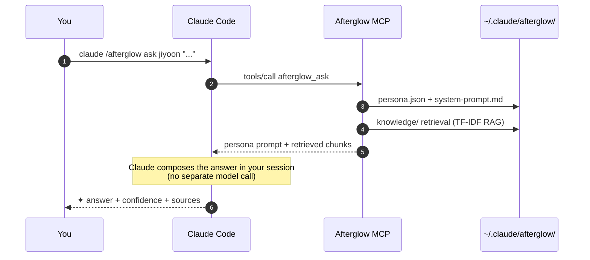

<div align="center">

# `@daeseoksong/afterglow-mcp`

**Keep your departed teammate in a folder — meet them again, as a persona agent, inside Claude Code.**

<p>
  <a href="./README.md"></a>
  
</p>

<p>
  <a href="https://www.npmjs.com/package/@daeseoksong/afterglow-mcp"></a>
  <a href="https://www.npmjs.com/package/@daeseoksong/afterglow-mcp"></a>
  <a href="./LICENSE"></a>
  <a href="https://nodejs.org/"></a>
  
  <a href="https://modelcontextprotocol.io"></a>
  <a href="https://github.com/DaeSeokSong/Afterglow"></a>
  <a href="https://github.com/DaeSeokSong/Afterglow/commits/main"></a>
</p>

<p>
  <a href="#-one-line-install"><b>One-line install</b></a> ·
  <a href="#-how-it-works">How it works</a> ·
  <a href="#-the-11-tools">11 tools</a> ·
  <a href="#-folder-layout">Folder layout</a> ·
  <a href="#-development">Dev</a> ·
  <a href="https://github.com/DaeSeokSong/Afterglow">GitHub →</a>
</p>

</div>

---

```
claude /afterglow ask jiyoon "Onboarding step-3 drop-off — how did you cut it?"

✦ Step-3 drop-off wasn't really a step-3 problem. We trimmed the step-2
  explanation in half and drop-off went 22% → 9%.
                                                       — Jiyoon · 91% confidence
  ↗ Confluence · DESIGN/onboarding-v2-postmortem
  ↗ ./materials/interview-2025-11-10.pdf · p. 14
```

> Drop a teammate's messages, docs, code, and interviews into one folder and Claude Code answers in their tone, citing their work. **No fine-tuning** — persona + RAG only, injected straight into Claude's context.

## ✦ One-line install

```bash
claude mcp add afterglow npx -y @daeseoksong/afterglow-mcp
```

No GPU, no embedding API, no external server. **Free.**

First session:

```bash
claude /afterglow init                                                # bootstrap ~/.claude/afterglow/
claude /afterglow create jiyoon --name 이지윤 --role "Product Designer"
claude /afterglow sign jiyoon --signer "Jiyoon Lee"                   # consent → status active
claude /afterglow list
claude /afterglow ask jiyoon "..."
```

## 🪶 Why this exists

| Old way | Afterglow |
| --- | --- |
| Hunt through old Slack / Notion threads | Ask the person directly — in their tone |
| Hand-off doc = written once, then stale | Hand-off doc = a living agent that keeps answering |
| Fine-tune a model → tied to one model version | **Persona + RAG** → 100% Claude Code compatible |
| Extra weights · GPU · inference bill | **Zero extra cost** — your existing Claude session does the work |
| Bot pretends to be the person | Every answer is marked ✦ with a confidence score and sources |

## 🧭 How it works



**`afterglow_ask` never calls an LLM.** It returns a bundle of (persona system prompt + RAG hits) so the Claude you already pay for writes the actual answer. → No extra model, GPU, or embedding API.

## 🛠 The 11 tools

<table>
  <thead>
    <tr>
      <th>MCP tool</th>
      <th>Slash command</th>
      <th>What it does</th>
    </tr>
  </thead>
  <tbody>
    <tr>
      <td><code>afterglow_init</code></td>
      <td><code>/afterglow init</code></td>
      <td>Bootstrap <code>~/.claude/afterglow/</code>. Idempotent.</td>
    </tr>
    <tr>
      <td><code>afterglow_create</code></td>
      <td><code>/afterglow create &lt;slug&gt; …</code></td>
      <td>Create one person's folder + <code>persona.json</code> + <code>system-prompt.md</code> + <code>consent.md</code>. Registered as <b>draft</b>.</td>
    </tr>
    <tr>
      <td><code>afterglow_sign</code></td>
      <td><code>/afterglow sign &lt;slug&gt; --signer "…"</code></td>
      <td>Append a signature block to <code>consent.md</code> and flip status <b>draft → active</b>. Unsigned agents are blocked from <code>ask</code> / <code>council</code>.</td>
    </tr>
    <tr>
      <td><code>afterglow_list</code></td>
      <td><code>/afterglow list</code></td>
      <td>Tabular / JSON listing. Supports <code>--status</code> and <code>--json</code>.</td>
    </tr>
    <tr>
      <td><code>afterglow_inspect</code></td>
      <td><code>/afterglow inspect &lt;slug&gt;</code></td>
      <td>Box-drawing render of persona · tone · sources · MCP allow/deny · folder path.</td>
    </tr>
    <tr>
      <td><code>afterglow_ask</code></td>
      <td><code>/afterglow ask &lt;slug&gt; "..."</code></td>
      <td>Return persona system prompt + TF-IDF RAG hits. <b>Claude in your session writes the answer.</b> Active agents only.</td>
    </tr>
    <tr>
      <td><code>afterglow_edit</code></td>
      <td><code>/afterglow edit &lt;slug&gt; …</code></td>
      <td>Patch persona fields (name / role / bio / expertise / tone / sources / MCP allow-deny / thresholds). Re-renders <code>system-prompt.md</code>; <code>--dry-run</code> previews diff without writing.</td>
    </tr>
    <tr>
      <td><code>afterglow_council</code></td>
      <td><code>/afterglow council &lt;slugs…&gt; "..."</code></td>
      <td>Gather 2–6 agents, attach each one's RAG hits to a shared brief, and seed a transcript file in <code>councils/</code> for Claude to run turn-by-turn.</td>
    </tr>
    <tr>
      <td><code>afterglow_history</code></td>
      <td><code>/afterglow history &lt;slug&gt;</code></td>
      <td>Filter the agent's <code>history.log</code> by date range / keyword / limit; JSON or table output.</td>
    </tr>
    <tr>
      <td><code>afterglow_audit</code></td>
      <td><code>/afterglow audit</code></td>
      <td>Read the SHA-256 hash-chained <code>audit.log</code> and verify the chain. Tampering is detected and the first bad sequence is reported.</td>
    </tr>
    <tr>
      <td><code>afterglow_recalibrate</code></td>
      <td><code>/afterglow recalibrate &lt;slug&gt;</code></td>
      <td>Analyse <code>history.log</code> (feedback / refusals / low-confidence / peer-ask rates) and suggest new <code>confidenceFloor</code> · <code>peerAskThreshold</code>. Dry-run by default; <code>--apply</code> to persist.</td>
    </tr>
  </tbody>
</table>

<details>
<summary><b>Input schemas (expand)</b></summary>

#### `afterglow_create`

| Field | Type | Required | Notes |
| --- | --- | --- | --- |
| `slug` | `string` | ✓ | lowercase letters / digits / hyphens |
| `name` | `string` | ✓ | display name |
| `role` | `string` | ✓ | title / team |
| `tenure` | `string` | | e.g. `2019.03 – 2025.11` |
| `bio` | `string` | | one-liner |
| `expertise` | `Expertise[]` | | design · dev · research · biz · sales · marketing · ops · HR · legal · finance · data |
| `sources` | `string[]` | | files or URLs |
| `mcpAllow` | `string[]` | | default `[filesystem]` |
| `mcpDeny` | `string[]` | | explicit denies |

#### `afterglow_edit`

Patch any subset of: `name` · `role` · `tenure` · `bio` · `addExpertise` / `removeExpertise` · `tone` · `addSources` / `removeSourceIds` · `mcpAllowAdd` / `mcpAllowRemove` · `mcpDenyAdd` / `mcpDenyRemove` · `confidenceFloor` · `peerAskThreshold` · `dryRun`.

#### `afterglow_council`

| Field | Type | Required | Notes |
| --- | --- | --- | --- |
| `slugs` | `string[]` | ✓ | 2–6 distinct agents, all active |
| `question` | `string` | ✓ | meeting topic |
| `topic` | `string` | | optional file-name hint |
| `topK` | `number` | | RAG chunks per participant (default 3) |

#### `afterglow_ask`

| Field | Type | Required | Notes |
| --- | --- | --- | --- |
| `slug` | `string` | ✓ | active agent |
| `question` | `string` | ✓ | the question |
| `topK` | `number` | | RAG chunks (1–12, default 4) |

</details>

## 📁 Folder layout

```
~/.claude/afterglow/
├─ config.yml                ← env config (embedding model · storage root)
├─ registry.json             ← agent index
├─ audit.log                 ← SHA-256 hash-chained tool log
├─ councils/                 ← council + peer-ask transcripts
└─ agents/<slug>/
   ├─ persona.json           ← zod-validated persona
   ├─ system-prompt.md       ← persona prompt injected into Claude
   ├─ mcp-allowlist.yml      ← (reserved) per-agent MCP allowlist
   ├─ consent.md             ← signed by the person → status active
   ├─ history.log            ← call / feedback / edit trail
   ├─ knowledge/             ← raw sources (PDF · MD · TXT · CSV · JSONL)
   └─ embeddings/            ← RAG index (PoC: TF-IDF terms; future: dense vectors)
```

That's the whole thing. Backup / move / delete / hand off = single-folder ops.

## ⚙ Environment variables

| Variable | Default | Purpose |
| --- | --- | --- |
| `AFTERGLOW_ROOT` | `~/.claude/afterglow` | Root of all data. Override for tests / isolation. |
| `AFTERGLOW_ALLOW_DRAFT` | unset | Set to `1` to bypass the `ask` / `council` consent gate. For tests / debugging only. |

## 🧑‍💻 Development

```bash
git clone https://github.com/DaeSeokSong/Afterglow.git
cd Afterglow/server
npm install
npm run build              # tsc → dist/
npm test                   # vitest (41 tests)
npm run test:stdio         # real MCP stdio handshake (all 11 tools + chain verify)
npm run test:all           # unit → build → stdio
```

### Project layout

```
server/
├─ src/
│  ├─ index.ts          ← MCP stdio entrypoint (McpServer + StdioServerTransport)
│  ├─ storage.ts        ← ~/.claude/afterglow/ filesystem adapter
│  ├─ persona.ts        ← zod schema + system-prompt rendering
│  ├─ rag.ts            ← TF-IDF retrieval (drop-in swap point)
│  ├─ audit.ts          ← SHA-256 hash-chained immutable log
│  └─ tools/
│     ├─ init.ts
│     ├─ create.ts
│     ├─ sign.ts
│     ├─ list.ts
│     ├─ inspect.ts
│     ├─ ask.ts
│     ├─ edit.ts
│     ├─ council.ts
│     ├─ history.ts
│     ├─ audit.ts
│     ├─ recalibrate.ts
│     └─ types.ts       ← ToolReply + safe() wrapper
├─ test/
│  ├─ storage.test.ts   ← vitest (12 tests)
│  ├─ tools.test.ts     ← vitest (29 tests, all v0.1.1 tools + RAG + edge cases)
│  └─ stdio.smoke.mjs   ← live MCP handshake against all 11 tools
├─ tsconfig.json
├─ vitest.config.ts
└─ package.json
```

### Swapping the RAG backend

`src/rag.ts` `retrieve()` is the drop-in point. The PoC ships TF-IDF (cosine over per-document term weights). To plug in dense vectors (OpenAI, Voyage, Cohere, local bge-m3, etc.):

```ts
export async function retrieve(slug: string, query: string, topK = 4): Promise<Retrieval[]> {
  // 1) embedding(query)
  // 2) cosine similarity against vectors in embeddings/
  // 3) return top-K
}
```

The `embeddings/` folder is created by `init` precisely so the on-disk shape is already there when you swap in vectors.

## 🗺 Roadmap

- [x] 11 tools shipped: init · create · sign · list · inspect · ask · edit · council · history · audit · recalibrate
- [x] zod persona schema + auto-rendered system prompt
- [x] TF-IDF RAG (offline · zero deps)
- [x] SHA-256 hash-chained audit log + verifier
- [x] Consent.md sign workflow (draft → active gate)
- [x] 41 vitest tests + full stdio handshake smoke
- [ ] Dense-vector RAG backend (drop-in inside `rag.ts`)
- [ ] Council moderator: stronger consensus detection + auto-summary
- [ ] `afterglow_archive` — archive + restore agents
- [ ] Per-topic recalibration (not just thresholds)

[Issues & PRs welcome.](https://github.com/DaeSeokSong/Afterglow/issues/new)

## 📜 License

[MIT](./LICENSE) © [DaeSeokSong](https://github.com/DaeSeokSong)

---

<div align="center">

**[GitHub](https://github.com/DaeSeokSong/Afterglow) · [npm](https://www.npmjs.com/package/@daeseoksong/afterglow-mcp) · [Issues](https://github.com/DaeSeokSong/Afterglow/issues)**

Made with ✦ for teammates who have left, but who we still carry with us.

</div>
