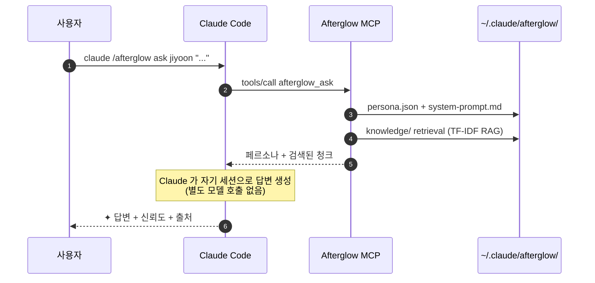

<div align="center">

# `@daeseoksong/afterglow-mcp`

**퇴사한 동료를 에이전트로 만들어서 퇴사 후 인수인계를 수월하게 하세요**

<p>
  
  <a href="./README.en.md"></a>
</p>

<p>
  <a href="https://www.npmjs.com/package/@daeseoksong/afterglow-mcp"></a>
  <a href="https://www.npmjs.com/package/@daeseoksong/afterglow-mcp"></a>
  <a href="./LICENSE"></a>
  <a href="https://nodejs.org/"></a>
  
  <a href="https://modelcontextprotocol.io"></a>
  <a href="https://github.com/DaeSeokSong/Afterglow"></a>
  <a href="https://github.com/DaeSeokSong/Afterglow/commits/main"></a>
</p>

<p>
  <a href="#-한-줄-설치"><b>한 줄 설치</b></a> ·
  <a href="#-동작-원리">동작 원리</a> ·
  <a href="#-도구-14개">도구 14개</a> ·
  <a href="#-폴더-구조">폴더 구조</a> ·
  <a href="#-development">개발</a> ·
  <a href="https://github.com/DaeSeokSong/Afterglow">GitHub →</a>
</p>

</div>

---

```
claude /afterglow ask jiyoon "온보딩 step 3 이탈, 어떻게 줄였어요?"

✦ step 3 이탈은 사실 step 3 잘못이 아니었어요. step 2 설명을 절반으로
  줄였더니 이탈이 22% → 9%로 떨어졌어요.
                                                       — 이지윤 · 신뢰도 91%
  ↗ Confluence · DESIGN/onboarding-v2-postmortem
  ↗ ./materials/interview-2025-11-10.pdf · p. 14
```

> 퇴사한 사람의 메시지·문서·코드·인터뷰 자료를 한 폴더에 모아두면, Claude Code 안에서 그 사람의 톤과 지식으로 답하는 페르소나 에이전트가 됩니다. **모델 학습은 없습니다** — 페르소나 + RAG만으로 Claude의 컨텍스트에 주입해요.

## ✦ 한 줄 설치

```bash
claude mcp add afterglow npx -y @daeseoksong/afterglow-mcp
```

별도 GPU · 임베딩 API · 외부 서버 필요 없음. **무료**.

이어서 첫 사용:

```bash
claude /afterglow init                                              # ~/.claude/afterglow/ 부트스트랩
claude /afterglow create jiyoon --name 이지윤 --role "프로덕트 디자이너"
claude /afterglow sign jiyoon --signer "이지윤"                      # consent.md 서명 → status active
claude /afterglow list
claude /afterglow ask jiyoon "온보딩 step 3 이탈, 어떻게 줄였어요?"
```

## 🪶 왜 만들었나

| 기존 방식 | Afterglow |
| --- | --- |
| 슬랙·노션에서 옛 메시지 검색 | 한 폴더로 인격화된 동료에게 직접 질문 |
| 퇴사자 인계 문서 = 한 번 쓰고 끝 | 인계 문서 = 살아있는 에이전트로 계속 진화 |
| LLM fine-tune → 모델 호환성 끊김 | **페르소나 + RAG** → Claude Code 100% 호환 |
| 모델 weight · GPU · 추론 비용 | **추가 비용 0** — Claude 세션 그대로 활용 |
| 사람 흉내내며 가짜 답변 | ✦ 마크 · 신뢰도 · 출처 항상 표시 · 모르면 모른다고 |

## 🧭 동작 원리



**핵심**: `afterglow_ask`는 LLM을 호출하지 않습니다. 페르소나와 검색 결과를 구조화된 텍스트로 묶어 반환하고, Claude Code 가 자기 컨텍스트로 직접 답변을 생성합니다. → 추가 모델 / GPU / 임베딩 API 0원.

## 🛠 도구 14개

<table>
  <thead>
    <tr>
      <th>MCP 도구</th>
      <th>슬래시 명령</th>
      <th>역할</th>
    </tr>
  </thead>
  <tbody>
    <tr>
      <td><code>afterglow_init</code></td>
      <td><code>/afterglow init</code></td>
      <td><code>~/.claude/afterglow/</code> 부트스트랩. 멱등 — 여러 번 실행 안전.</td>
    </tr>
    <tr>
      <td><code>afterglow_create</code></td>
      <td><code>/afterglow create &lt;slug&gt; …</code></td>
      <td>한 사람의 폴더 + <code>persona.json</code> + <code>system-prompt.md</code> + <code>consent.md</code> 생성. <code>registry.json</code>에 <b>draft</b> 등록.</td>
    </tr>
    <tr>
      <td><code>afterglow_sign</code></td>
      <td><code>/afterglow sign &lt;slug&gt; --signer "…"</code></td>
      <td><code>consent.md</code>에 서명 블록 추가 + status <b>draft → active</b> 전환. 미서명 에이전트는 <code>ask</code> / <code>council</code> 거부.</td>
    </tr>
    <tr>
      <td><code>afterglow_resume</code></td>
      <td><code>/afterglow resume &lt;slug&gt;</code></td>
      <td>paused / draft / learning 상태의 에이전트를 다시 active 로. <code>archive → restore</code> 직후, 또는 본인이 자리를 비웠다 돌아왔는데 기존 서명이 유효한 경우 사용. archived 는 거부 — 먼저 <code>--action restore</code> 필요.
        <br><sub>⚠ <code>resume</code> 은 consent gate 를 <b>우회</b>합니다 (consent.md 가 유효한지 사용자 판단). 새 서명이 필요한 케이스에는 <code>sign</code> 을 쓰세요.</sub></td>
    </tr>
    <tr>
      <td><code>afterglow_list</code></td>
      <td><code>/afterglow list</code></td>
      <td>등록된 모든 에이전트를 표 / JSON 출력. <code>--status</code>, <code>--json</code> 지원.</td>
    </tr>
    <tr>
      <td><code>afterglow_inspect</code></td>
      <td><code>/afterglow inspect &lt;slug&gt;</code></td>
      <td>페르소나 · 톤 · 자료 · MCP 권한을 박스 드로잉으로 한 화면에 표시.</td>
    </tr>
    <tr>
      <td><code>afterglow_ask</code></td>
      <td><code>/afterglow ask &lt;slug&gt; "..."</code></td>
      <td>페르소나 system prompt + TF-IDF RAG 검색 결과를 묶어 반환. <b>Claude가 그 컨텍스트로 직접 답변.</b> active 에이전트만 허용.</td>
    </tr>
    <tr>
      <td><code>afterglow_edit</code></td>
      <td><code>/afterglow edit &lt;slug&gt; …</code></td>
      <td>persona.json 부분 수정 (이름·역할·소개·영역·톤·자료·MCP 권한·신뢰도). system-prompt.md 자동 재생성. <code>--dry-run</code>으로 미리보기.</td>
    </tr>
    <tr>
      <td><code>afterglow_council</code></td>
      <td><code>/afterglow council &lt;slugs…&gt; "..."</code></td>
      <td>2–6명 에이전트의 persona + RAG 컨텍스트를 묶어 회의 브리프 + <code>councils/&lt;timestamp&gt;.md</code> 회의록 스켈레톤 생성. Claude가 turn별 발언을 진행.</td>
    </tr>
    <tr>
      <td><code>afterglow_history</code></td>
      <td><code>/afterglow history &lt;slug&gt;</code></td>
      <td><code>history.log</code>를 시각 / 키워드 / 개수로 필터. <code>--since</code> / <code>--until</code> / <code>--filter</code> / <code>--limit</code> / <code>--json</code> / <code>--reverse</code>.</td>
    </tr>
    <tr>
      <td><code>afterglow_audit</code></td>
      <td><code>/afterglow audit</code></td>
      <td>모든 도구 호출이 누적되는 <b>SHA-256 hash-chained audit log</b> 표시 + 체인 무결성 검증. 위변조 시 첫 깨진 seq 식별.</td>
    </tr>
    <tr>
      <td><code>afterglow_recalibrate</code></td>
      <td><code>/afterglow recalibrate &lt;slug&gt;</code></td>
      <td><code>history.log</code> 분석 (피드백·거절·low-conf·peer-ask 비율) → <code>confidenceFloor</code> / <code>peerAskThreshold</code> 자동 조정 제안. 기본 dry-run, <code>--apply</code>로 실제 반영. <code>--byTopic</code>은 expertise 별 진단 모드.</td>
    </tr>
    <tr>
      <td><code>afterglow_archive</code></td>
      <td><code>/afterglow archive &lt;slug&gt; --action archive|restore|list</code></td>
      <td><code>agents/&lt;slug&gt;/</code> ↔ <code>archive/&lt;slug&gt;/</code> 사이로 폴더를 옮기고 status 를 <b>archived ↔ paused</b> 로 전환. 보관된 에이전트는 <code>ask</code> / <code>council</code> 거부. 복원은 paused 로 진입해 재서명 필요.</td>
    </tr>
    <tr>
      <td><code>afterglow_council_summary</code></td>
      <td><code>/afterglow council summary [file]</code></td>
      <td><code>councils/&lt;file&gt;.md</code> 회의록 파싱 → 참가자 · <b>결론</b> · <b>이견</b> · 합의 도달 여부 · ping 흐름 · 발언량을 구조화된 요약으로 출력. 파일 미지정 시 가장 최근 회의록 자동 선택.</td>
    </tr>
  </tbody>
</table>

<details>
<summary><b>입력 스키마 자세히 보기</b></summary>

#### `afterglow_create`

| 필드 | 타입 | 필수 | 설명 |
| --- | --- | --- | --- |
| `slug` | `string` | ✓ | 짧은 식별자. 소문자/숫자/하이픈 |
| `name` | `string` | ✓ | 실제 이름 |
| `role` | `string` | ✓ | 직무 / 부서 |
| `tenure` | `string` | | 재직 기간 |
| `bio` | `string` | | 한 줄 소개 |
| `expertise` | `Expertise[]` | | 디자인 · 개발 · 연구 · 사업화 · 영업 · 마케팅 · 운영 · 인사 · 법무 · 재무 · 데이터 중 다중 선택 |
| `sources` | `string[]` | | 학습 자료 파일 경로 또는 URL |
| `mcpAllow` | `string[]` | | 이 에이전트가 호출 가능한 MCP (기본 `[filesystem]`) |
| `mcpDeny` | `string[]` | | 명시 거부할 MCP |

#### `afterglow_ask`

| 필드 | 타입 | 필수 | 설명 |
| --- | --- | --- | --- |
| `slug` | `string` | ✓ | 질문 받을 에이전트 |
| `question` | `string` | ✓ | 질문 |
| `topK` | `number` | | RAG 결과 청크 개수 (1–12, 기본 4) |

</details>

## 📁 폴더 구조

```
~/.claude/afterglow/
├─ config.yml                ← 환경 설정 (embedding model · storage root)
├─ registry.json             ← 전체 에이전트 인덱스
├─ audit.log                 ← SHA-256 hash-chained 도구 호출 로그
├─ councils/                 ← council + peer-ask 회의록 (markdown)
├─ archive/                  ← 보관(archived)된 에이전트 폴더 (restore 시 agents/ 로 복귀)
└─ agents/<slug>/
   ├─ persona.json           ← zod 검증된 페르소나
   ├─ system-prompt.md       ← Claude에 주입할 페르소나 프롬프트
   ├─ mcp-allowlist.yml      ← (예약) 에이전트별 MCP 권한
   ├─ consent.md             ← 서명 → status draft → active
   ├─ history.log            ← 호출 / 피드백 / 수정 누적
   ├─ knowledge/             ← 원본 자료 (PDF · MD · TXT · CSV · JSONL)
   └─ embeddings/            ← RAG 인덱스 (PoC: TF-IDF, 추후 dense vector)
```

이게 전부입니다. 백업·이동·삭제·인계 = 폴더 통째로 처리.

## ⚙ Environment Variables

| 변수 | 기본값 | 용도 |
| --- | --- | --- |
| `AFTERGLOW_ROOT` | `~/.claude/afterglow` | 모든 데이터의 루트. 테스트 / dev 환경 격리 시 임시 폴더 지정. |
| `AFTERGLOW_ALLOW_DRAFT` | unset | `1` 로 설정 시 `ask` / `council`의 active 게이트 우회. 테스트/디버그 전용. |

## 🧑‍💻 Development

```bash
git clone https://github.com/DaeSeokSong/Afterglow.git
cd Afterglow/server
npm install
npm run build              # tsc → dist/
npm test                   # vitest (74 tests — storage 12 + tools 29 + phase4 33)
npm run test:stdio         # 실제 MCP stdio 핸드셰이크 (14 도구 모두 happy-path + 체인 검증)
npm run test:all           # 전체 (unit → build → stdio)
```

### 프로젝트 구조

```
server/
├─ src/
│  ├─ index.ts          ← MCP stdio 진입점 (McpServer + StdioServerTransport)
│  ├─ storage.ts        ← ~/.claude/afterglow/ 파일시스템 어댑터 + consent gate + history 파싱
│  ├─ persona.ts        ← zod schema + 시스템 프롬프트 렌더링
│  ├─ rag.ts            ← TF-IDF chunk retrieval (drop-in 교체 지점)
│  ├─ audit.ts          ← SHA-256 hash-chained immutable log
│  └─ tools/
│     ├─ init.ts
│     ├─ create.ts
│     ├─ sign.ts
│     ├─ resume.ts          ← consent gate 우회 1-step 재활성화
│     ├─ list.ts
│     ├─ inspect.ts
│     ├─ ask.ts
│     ├─ edit.ts
│     ├─ council.ts
│     ├─ council_summary.ts
│     ├─ history.ts
│     ├─ audit.ts
│     ├─ recalibrate.ts   ← global + by-topic (expertise-aware)
│     ├─ archive.ts       ← archive / restore / list
│     └─ types.ts       ← ToolReply + safe() 래퍼
├─ test/
│  ├─ storage.test.ts   ← vitest (12 tests)
│  ├─ tools.test.ts     ← vitest (29 tests — v0.1.1 도구 + RAG + 엣지케이스)
│  ├─ phase4.test.ts    ← vitest (33 tests — archive / council_summary / by-topic / resume + 회귀)
│  └─ stdio.smoke.mjs   ← 실제 MCP stdio 핸드셰이크 (14 도구 + archive 라운드트립)
├─ tsconfig.json
├─ vitest.config.ts
└─ package.json
```

### RAG 확장

`src/rag.ts` 의 `retrieve()` 가 drop-in 교체 지점입니다. PoC는 키워드 token overlap이지만, dense vector backend (OpenAI embeddings, Voyage, Cohere, 로컬 bge-m3 등)로 바꾸려면:

```ts
export async function retrieve(slug: string, query: string, topK = 4): Promise<Retrieval[]> {
  // 1) embedding(query)
  // 2) embeddings/ 안의 벡터와 cosine similarity
  // 3) topK 반환
}
```

`embeddings/` 폴더는 PoC에서도 이미 생성됩니다 — 백엔드만 갈아끼우면 됩니다.

## 🗺 Roadmap

- [x] 14 도구 전부 출시: init · create · sign · resume · list · inspect · ask · edit · council · council_summary · history · audit · recalibrate · archive
- [x] zod 스키마 + 시스템 프롬프트 자동 렌더링
- [x] TF-IDF RAG (오프라인 · 외부 의존성 0)
- [x] SHA-256 hash-chained 감사 로그 + 무결성 검증
- [x] consent.md 서명 워크플로우 (draft → active 게이트)
- [x] 신뢰도 보정: 전역 + **expertise-aware by-topic** 진단
- [x] **`afterglow_archive`** — 에이전트 보관 / 복원
- [x] **Council moderator** — 강화된 합의 감지 + `afterglow_council_summary` 자동 요약
- [x] vitest 74개 + 전 도구 stdio 핸드셰이크
- [ ] Web companion: 공유 가능한 read-only "afterglow 페이지"
- [ ] Slack 연동

[기여 환영](https://github.com/DaeSeokSong/Afterglow/issues/new) — 이슈 / PR / 사용 사례 모두 좋아요.

## 📜 License

[Apache-2.0](./LICENSE) © [DaeSeokSong](https://github.com/DaeSeokSong)

---

<div align="center">

**[GitHub](https://github.com/DaeSeokSong/Afterglow) · [npm](https://www.npmjs.com/package/@daeseoksong/afterglow-mcp) · [Issues](https://github.com/DaeSeokSong/Afterglow/issues)**

Made with ✦ for 퇴사하셨지만 아직 우리 곁에 있는 동료들에게.

</div>
