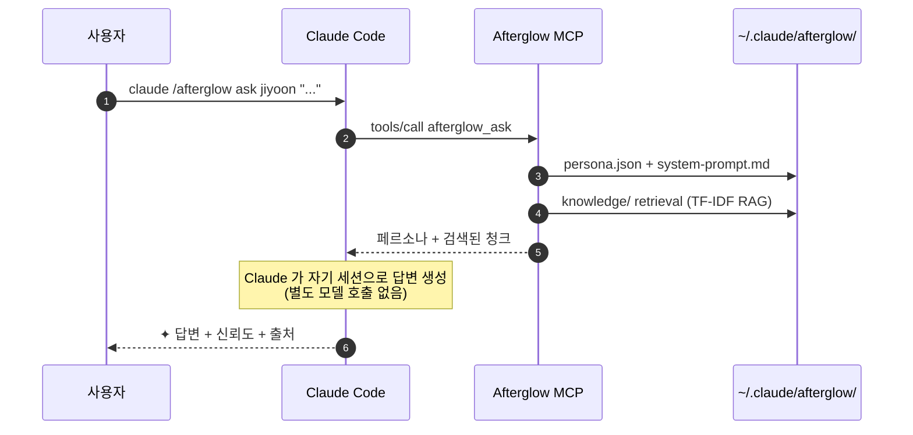

<div align="center">

# `@daeseoksong/afterglow-mcp`

**퇴사한 동료를 에이전트로 만들어서 퇴사 후 인수인계를 수월하게 하세요**

<p>
  
  <a href="./README.en.md"></a>
</p>

<p>
  <a href="https://www.npmjs.com/package/@daeseoksong/afterglow-mcp"></a>
  <a href="https://www.npmjs.com/package/@daeseoksong/afterglow-mcp"></a>
  <a href="./LICENSE"></a>
  <a href="https://nodejs.org/"></a>
  
  <a href="https://modelcontextprotocol.io"></a>
  <a href="https://github.com/DaeSeokSong/Afterglow"></a>
  <a href="https://github.com/DaeSeokSong/Afterglow/commits/main"></a>
</p>

<p>
  <a href="#-한-줄-설치"><b>한 줄 설치</b></a> ·
  <a href="#-동작-원리">동작 원리</a> ·
  <a href="#-도구-24개">도구 24개</a> ·
  <a href="#-추가-인터뷰--미디어-첨부">추가 인터뷰</a> ·
  <a href="#-핫플러그--exportimport">핫플러그</a> ·
  <a href="#-폴더-구조">폴더 구조</a> ·
  <a href="#-development">개발</a> ·
  <a href="https://github.com/DaeSeokSong/Afterglow">GitHub →</a>
</p>

</div>

---

```
claude /afterglow ask jiyoon "온보딩 step 3 이탈, 어떻게 줄였어요?"

✦ step 3 이탈은 사실 step 3 잘못이 아니었어요. step 2 설명을 절반으로
  줄였더니 이탈이 22% → 9%로 떨어졌어요.
                                                       — 이지윤 · 신뢰도 91%
  ↗ Confluence · DESIGN/onboarding-v2-postmortem
  ↗ ./materials/interview-2025-11-10.pdf · p. 14
```

> 퇴사한 사람의 메시지·문서·코드·인터뷰 자료를 한 폴더에 모아두면, Claude Code 안에서 그 사람의 톤과 지식으로 답하는 페르소나 에이전트가 됩니다. **모델 학습은 없습니다** — 페르소나 + RAG만으로 Claude의 컨텍스트에 주입해요.

## ✦ 한 줄 설치

```bash
claude mcp add afterglow npx -y @daeseoksong/afterglow-mcp
```

별도 GPU · 임베딩 API · 외부 서버 필요 없음. **무료**.

이어서 첫 사용:

```bash
claude /afterglow init                                              # ~/.claude/afterglow/ 부트스트랩
claude /afterglow create jiyoon --name 이지윤 --role "프로덕트 디자이너"
claude /afterglow sign jiyoon --signer "이지윤"                      # consent.md 서명 → status active
claude /afterglow list
claude /afterglow ask jiyoon "온보딩 step 3 이탈, 어떻게 줄였어요?"
```

> **참고 — 두 가지 호출 방식.** Afterglow 는 MCP 서버라 도구는 실제로 `afterglow_handoff({slug: "jiyoon", action: "start"})` 같은 JSON 호출입니다.
> 1. **자연어**: "afterglow 초기화해줘" → Claude 가 알맞은 도구 호출.
> 2. **슬래시 명령**: Claude Code 입력창에서 **`/mcp__afterglow__<이름>`** (예: `/mcp__afterglow__init`) 직접 호출 + 인자 자동완성 — MCP prompt 로 노출됩니다 (형식이 `/afterglow init` 이 아니라 `/mcp__afterglow__init`).
>
> 본 README 의 `claude /afterglow …` 표기는 약식이며, 실제로는 위 두 방식 중 하나로 씁니다.
>
> **슬래시 명령 24종** — 입력창에 **`afterglow:`** 치면 목록 → 화살표 선택 → **Tab** → `/mcp__afterglow__<이름>` 으로 입력되고 회색 힌트로 인자 안내. 도구 24개 전부 1:1로 노출됩니다: `init` · `create` · `sign` · `resume` · `archive` · `list` · `status` · `inspect` · `ask` · `edit` · `history` · `correct` · `recalibrate` · `access` · `audit` · `version` · `gc` · `handoff` · `interview` · `council` · `council-summary` · `export` · `import` · `verify`. (명령별 인자·예시 표는 루트 [README](../README.md) 의 "슬래시 명령" 절 참고.) 자연어로도 동일하게 호출됩니다.

## 🪶 왜 만들었나

| 기존 방식 | Afterglow |
| --- | --- |
| 슬랙·노션에서 옛 메시지 검색 | 한 폴더로 인격화된 동료에게 직접 질문 |
| 퇴사자 인계 문서 = 한 번 쓰고 끝 | 인계 문서 = 살아있는 에이전트로 계속 진화 |
| LLM fine-tune → 모델 호환성 끊김 | **페르소나 + RAG** → Claude Code 100% 호환 |
| 모델 weight · GPU · 추론 비용 | **추가 비용 0** — Claude 세션 그대로 활용 |
| 사람 흉내내며 가짜 답변 | ✦ 마크 · 신뢰도 · 출처 항상 표시 · 모르면 모른다고 |

## 🧭 동작 원리



**핵심**: `afterglow_ask`는 LLM을 호출하지 않습니다. 페르소나와 검색 결과를 구조화된 텍스트로 묶어 반환하고, Claude Code 가 자기 컨텍스트로 직접 답변을 생성합니다. → 추가 모델 / GPU / 임베딩 API 0원.

## 🛠 도구 24개

> v0.2.0 에서 **`interview` · `export` · `import` · `verify`** 4개가 추가됐습니다 (18 → 22). 다중 인터뷰는 [추가 인터뷰 + 미디어 첨부](#-추가-인터뷰--미디어-첨부), 에이전트 이식은 [핫플러그](#-핫플러그--exportimport) 절을 보세요.

<table>
  <thead>
    <tr>
      <th>MCP 도구</th>
      <th>슬래시 명령</th>
      <th>역할</th>
    </tr>
  </thead>
  <tbody>
    <tr>
      <td><code>afterglow_init</code></td>
      <td><code>/afterglow init</code></td>
      <td><code>~/.claude/afterglow/</code> 부트스트랩. 멱등 — 여러 번 실행 안전.</td>
    </tr>
    <tr>
      <td><code>afterglow_create</code></td>
      <td><code>/afterglow create &lt;slug&gt; …</code></td>
      <td>한 사람의 폴더 + <code>persona.json</code> + <code>system-prompt.md</code> + <code>consent.md</code> 생성. <code>registry.json</code>에 <b>draft</b> 등록.</td>
    </tr>
    <tr>
      <td><code>afterglow_sign</code></td>
      <td><code>/afterglow sign &lt;slug&gt; --signer "…"</code></td>
      <td><code>consent.md</code>에 서명 블록 추가 + status <b>draft → active</b> 전환. 미서명 에이전트는 <code>ask</code> / <code>council</code> 거부.
        <br><sub>⚠ <code>signer</code> 값은 그대로 기록만 됩니다 — 본인 인증(SSO·MFA) 없음. HR 대리 서명 시 <code>"HR · 김OO (대리, 본인 부재)"</code> 처럼 <b>대리</b>를 명시하세요. PoC 가정.</sub></td>
    </tr>
    <tr>
      <td><code>afterglow_resume</code></td>
      <td><code>/afterglow resume &lt;slug&gt;</code></td>
      <td>paused / draft / learning 상태의 에이전트를 다시 active 로. <code>archive → restore</code> 직후, 또는 본인이 자리를 비웠다 돌아왔는데 기존 서명이 유효한 경우 사용. archived 는 거부 — 먼저 <code>--action restore</code> 필요.
        <br><sub>⚠ <code>resume</code> 은 consent gate 를 <b>우회</b>합니다 (consent.md 가 유효한지 사용자 판단). 새 서명이 필요한 케이스에는 <code>sign</code> 을 쓰세요.</sub></td>
    </tr>
    <tr>
      <td><code>afterglow_handoff</code></td>
      <td><code>/afterglow handoff &lt;slug&gt; --action start|review|status|finalize|abort</code></td>
      <td><b>본인 인계 모드 (self-review onboarding).</b> 퇴사자 본인이 자기 에이전트의 샘플 질문 N 개를 직접 검수. 각 질문에 <code>keep</code> / <code>edit</code> / <code>decline</code> 셋 중 하나. 동료가 미리 적어둔 <code>questions.txt</code> 도 받음 (에이전트 폴더 또는 CWD 안 — 절대경로 임의 파일 차단). 본인 서명으로 active 전환되고, <code>edit</code> 한 답변은 <code>persona.bio</code> 의 <code>## handoff 답변</code> 블록으로, <code>decline</code> 한 질문은 <code>## 답하지 않기로 한 영역</code> 블록으로 흡수돼서 다음 ask 부터 우선 인용됩니다.</td>
    </tr>
    <tr>
      <td><code>afterglow_correct</code></td>
      <td><code>/afterglow correct &lt;slug&gt; --action feedback|edit-answer|save-rule|list</code></td>
      <td>ask 결과에 자연어 피드백 (<code>feedback</code> "이 부분만 다시 써줘"), 답변 라인 직접 편집 (<code>edit-answer</code>), 반복 패턴을 규칙으로 저장 (<code>save-rule</code>). <code>corrections.log</code> + <code>history.log</code> + <code>audit</code> 모두 누적.</td>
    </tr>
    <tr>
      <td><code>afterglow_version</code></td>
      <td><code>/afterglow version &lt;slug&gt; --action list|diff|rollback|tag|snapshot</code></td>
      <td>persona 버전 히스토리. <code>edit</code> / <code>sign</code> / <code>recalibrate apply</code> / <code>handoff finalize</code> 시 자동 스냅샷. <code>diff</code> 두 버전 비교, <code>rollback</code> 복원 (안전 스냅샷 자동), <code>tag</code> 로 stable · handoff-signed 같은 라벨, <code>snapshot</code> 수동 백업. <code>agents/&lt;slug&gt;/.versions/</code> 에 보관.</td>
    </tr>
    <tr>
      <td><code>afterglow_access</code></td>
      <td><code>/afterglow access &lt;slug&gt; --action list|allow|deny|remove|set-default|check</code></td>
      <td><code>user:</code> / <code>role:</code> / <code>team:</code> 단위 allow/deny 리스트 + default 정책. <code>ask</code> 호출 시 <code>caller</code> 인자 주면 자동 체크 (없으면 anonymous). <code>check</code> 액션으로 안전하게 시뮬레이션.</td>
    </tr>
    <tr>
      <td><code>afterglow_list</code></td>
      <td><code>/afterglow list</code></td>
      <td>등록된 모든 에이전트를 표 / JSON 출력. <code>--status</code>, <code>--json</code> 지원.</td>
    </tr>
    <tr>
      <td><code>afterglow_inspect</code></td>
      <td><code>/afterglow inspect &lt;slug&gt;</code></td>
      <td>페르소나 · 톤 · 자료 · MCP 권한을 박스 드로잉으로 한 화면에 표시.</td>
    </tr>
    <tr>
      <td><code>afterglow_ask</code></td>
      <td><code>/afterglow ask &lt;slug&gt; "..."</code></td>
      <td>페르소나 system prompt + TF-IDF RAG 검색 결과를 묶어 반환. <b>Claude가 그 컨텍스트로 직접 답변.</b> active 에이전트만 허용.</td>
    </tr>
    <tr>
      <td><code>afterglow_edit</code></td>
      <td><code>/afterglow edit &lt;slug&gt; …</code></td>
      <td>persona.json 부분 수정 (이름·역할·소개·영역·톤·자료·MCP 권한·신뢰도). system-prompt.md 자동 재생성. <code>--dry-run</code>으로 미리보기.</td>
    </tr>
    <tr>
      <td><code>afterglow_council</code></td>
      <td><code>/afterglow council &lt;slugs…&gt; "..."</code></td>
      <td>2–6명 에이전트의 persona + RAG 컨텍스트를 묶어 회의 브리프 + <code>councils/&lt;timestamp&gt;.md</code> 회의록 스켈레톤 생성. Claude가 turn별 발언을 진행.</td>
    </tr>
    <tr>
      <td><code>afterglow_history</code></td>
      <td><code>/afterglow history &lt;slug&gt;</code></td>
      <td><code>history.log</code>를 시각 / 키워드 / 개수로 필터. <code>--since</code> / <code>--until</code> / <code>--filter</code> / <code>--limit</code> / <code>--json</code> / <code>--reverse</code>.</td>
    </tr>
    <tr>
      <td><code>afterglow_audit</code></td>
      <td><code>/afterglow audit</code></td>
      <td>모든 도구 호출이 누적되는 <b>SHA-256 hash-chained audit log</b> 표시 + 체인 무결성 검증. 위변조 시 첫 깨진 seq 식별.</td>
    </tr>
    <tr>
      <td><code>afterglow_recalibrate</code></td>
      <td><code>/afterglow recalibrate &lt;slug&gt;</code></td>
      <td><code>history.log</code> 분석 (피드백·거절·low-conf·peer-ask 비율) → <code>confidenceFloor</code> / <code>peerAskThreshold</code> 자동 조정 제안. 기본 dry-run, <code>--apply</code>로 실제 반영. <code>--byTopic</code>은 expertise 별 진단 모드.</td>
    </tr>
    <tr>
      <td><code>afterglow_archive</code></td>
      <td><code>/afterglow archive &lt;slug&gt; --action archive|restore|list</code></td>
      <td><code>agents/&lt;slug&gt;/</code> ↔ <code>archive/&lt;slug&gt;/</code> 사이로 폴더를 옮기고 status 를 <b>archived ↔ paused</b> 로 전환. 보관된 에이전트는 <code>ask</code> / <code>council</code> 거부. 복원은 paused 로 진입해 재서명 필요.</td>
    </tr>
    <tr>
      <td><code>afterglow_council_summary</code></td>
      <td><code>/afterglow council summary [file]</code></td>
      <td><code>councils/&lt;file&gt;.md</code> 회의록 파싱 → 참가자 · <b>결론</b> · <b>이견</b> · 합의 도달 여부 · ping 흐름 · 발언량을 구조화된 요약으로 출력. 파일 미지정 시 가장 최근 회의록 자동 선택.</td>
    </tr>
    <tr>
      <td><code>afterglow_interview</code> <sub>v0.2</sub></td>
      <td><code>/afterglow interview &lt;slug&gt; --action start|add-question|answer|gap-check|attach|annotate|status|list|inspect|finalize|abort|transcribe|export-sheet|import-answers</code></td>
      <td><b>인계자 주도 다중 인터뷰.</b> <code>handoff</code>(본인 1회 셀프검수)와 달리 인계자(인터뷰어)가 퇴사자(인터뷰이)를 <b>회차 무제한</b> 인터뷰. <code>gap-check</code>는 빠진 부분을 4신호로 자동 감지(LLM 비호출), <code>attach</code>는 음성·영상 첨부(transcript만 RAG 인덱싱), <code>annotate</code>는 인터뷰이 부재 시 인계자 주석, <code>finalize</code>는 인터뷰어+인터뷰이 <b>이중 서명</b>. 답변은 <code>persona.bio</code> 의 <code>## 인터뷰 보강 #N</code> 블록으로 누적.</td>
    </tr>
    <tr>
      <td><code>afterglow_export</code> <sub>v0.2</sub></td>
      <td><code>/afterglow export --slugs jiyoon jaehoon | --all</code></td>
      <td>하나 이상의 에이전트를 portable <b>번들</b>(폴더 + <code>manifest.json</code> + 폴더별 무결성 해시)로 내보냄. <code>embeddings/</code>는 제외(재생성 가능). 번들을 압축/복사해 다른 사용자에게 전달.</td>
    </tr>
    <tr>
      <td><code>afterglow_import</code> <sub>v0.2</sub></td>
      <td><code>/afterglow import &lt;path&gt; [--as | --merge | --dryRun | --acceptBrokenChain]</code></td>
      <td><b>핫플러그.</b> 받은 번들/폴더를 가져와 자동 인식. 스키마·서명·무결성 해시·심볼릭링크·프롬프트 인젝션을 검증하고 <code>provenance.json</code>(출처·신뢰도·전달 이력)을 기록. 서명된 에이전트는 <b>active</b>, 미서명은 <b>paused</b>. slug 충돌은 <code>--as</code>(이름 변경) / <code>--merge</code>(인터뷰 회차만 병합).</td>
    </tr>
    <tr>
      <td><code>afterglow_verify</code> <sub>v0.2</sub></td>
      <td><code>/afterglow verify &lt;path&gt;</code></td>
      <td>import 전 <b>읽기 전용</b> 사전 검증. 스키마·서명·무결성·심볼릭링크·인젝션 의심을 체크리스트로 보여주되 로컬 저장소는 건드리지 않음.</td>
    </tr>
    <tr>
      <td><code>afterglow_status</code> <sub>v0.3</sub></td>
      <td><code>/afterglow status</code></td>
      <td><b>전체 대시보드.</b> 모든 에이전트의 상태·인터뷰 회차(완료/대기)·검토 대기 미디어·import 출처/신뢰도를 한 번에. 개별 <code>inspect</code> 보완. <code>--json</code>.</td>
    </tr>
    <tr>
      <td><code>afterglow_gc</code> <sub>v0.3</sub></td>
      <td><code>/afterglow gc --action list|prune-versions|purge-media|purge-archive [--apply]</code></td>
      <td><b>보존/정리(retention).</b> 오래된 persona 스냅샷 정리(태그 보존) · 인터뷰 미디어 원본 삭제(전사본 유지·GDPR) · 보관함 영구 삭제. 기본 <b>dry-run</b>, <code>--apply</code> 로 실제 삭제.</td>
    </tr>
  </tbody>
</table>

> v0.3 에서 <code>interview</code> 에 <b>suggest-questions</b>(회차 전 질문 제안) · <b>transcribe</b>(<code>--text</code> 폴리시 저장 / <code>--apply</code> 로컬 whisper) · <b>review</b>(검토 후 인덱싱) 액션이, <code>import</code> 에 <b>--expectAnchor</b>(번들 위변조 탐지), <code>audit</code> 에 <b>--checkpoint/--fast</b>(대용량 증분 검증)가 추가됐습니다.
>
> v0.4 에서 RAG 랭킹이 <b>BM25</b> 로 업그레이드(+ opt-in <b>dense-vector</b> 백엔드 `AFTERGLOW_RAG_BACKEND=dense`), <code>transcribe</code> 에 <b>--download/--list-models</b>(ggml 모델 관리)가 추가됐습니다.
>
> v0.8 에서 <b>WASM whisper 엔진</b>(<code>transcribe --apply</code>, `@xenova/transformers` optionalDependency — 네이티브 빌드 불필요), <b>하이브리드 RAG 재랭킹</b>(dense+lexical RRF 융합), 전사본 <b>PII 마스킹</b>(`AFTERGLOW_PII_REDACT=1`)·<b>저장 암호화</b>(`AFTERGLOW_ENCRYPTION_KEY`, AES-256-GCM), <code>interview start</code> 의 <b>자동 질문 제안</b>(진행 여부 자동 질의)이 추가됐습니다.

<details>
<summary><b>입력 스키마 자세히 보기</b></summary>

#### `afterglow_create`

| 필드 | 타입 | 필수 | 설명 |
| --- | --- | --- | --- |
| `slug` | `string` | ✓ | 짧은 식별자. 소문자/숫자/하이픈 |
| `name` | `string` | ✓ | 실제 이름 |
| `role` | `string` | ✓ | 직무 / 부서 |
| `tenure` | `string` | | 재직 기간 |
| `bio` | `string` | | 한 줄 소개 |
| `expertise` | `Expertise[]` | | 디자인 · 개발 · 연구 · 사업화 · 영업 · 마케팅 · 운영 · 인사 · 법무 · 재무 · 데이터 중 다중 선택 |
| `sources` | `string[]` | | 학습 자료 파일 경로 또는 URL |
| `mcpAllow` | `string[]` | | 이 에이전트가 호출 가능한 MCP (기본 `[filesystem]`) |
| `mcpDeny` | `string[]` | | 명시 거부할 MCP |

#### `afterglow_ask`

| 필드 | 타입 | 필수 | 설명 |
| --- | --- | --- | --- |
| `slug` | `string` | ✓ | 질문 받을 에이전트 |
| `question` | `string` | ✓ | 질문 |
| `topK` | `number` | | RAG 결과 청크 개수 (1–12, 기본 4) |

</details>

## 🎤 추가 인터뷰 + 미디어 첨부

`handoff` 가 퇴사자 **본인의 1회 셀프 검수**라면, `interview` 는 **인계자가 퇴사자를 여러 번 인터뷰**하는 흐름입니다. 자료를 받아보면 꼭 추가 질문이 생기거나 퇴사자가 빠뜨린 부분이 나오니까요.

```bash
# 1. 인계자(인터뷰어)가 회차 시작 — 인터뷰이(퇴사자)와 대면/통화
claude /afterglow interview jiyoon --action start \
  --title "결제 fallback 갭" --interviewer "김후임" --interviewee "이지윤"
#   → 인터뷰이가 consent 서명자와 일치하는지 자동 대조 (✓ / ⚠)

# 2. 질문 추가 → 답변 기록 (source: self-typed | voice | interviewer-summary)
claude /afterglow interview jiyoon --action add-question --session 001-결제-fallback-갭 \
  --question "5초 timeout 후 정책은?"
claude /afterglow interview jiyoon --action answer --session 001-결제-fallback-갭 \
  --id q-… --answer "다음 PG 로 자동 전환" --source voice --audioRef clip-001.mp3

# 3. 갭 자동 감지 — Claude 가 빠진 부분을 짚어 후속 질문 생성 (LLM 추가 호출 0)
claude /afterglow interview jiyoon --action gap-check --session 001-결제-fallback-갭
#   → [G1 material-conflict] 자료[2] '재시도 대화창' vs 답변 '자동 전환' 충돌 …
#   → 채택한 질문은 --action add-question --fromGap material-conflict 로 추가

# 4. 음성/영상 첨부 — 원본 보존 + 전사본(.md/.txt)만 RAG 인덱싱
claude /afterglow interview jiyoon --action attach --session 001-결제-fallback-갭 \
  --file ./exit-interview.mp3 --transcript ./exit-interview.txt \
  --speakers 이지윤,김후임 --consentScope "내부 인계용"
#   ⚠ 오디오/비디오는 speakers(발화자) 명시 필수 — 동의 안 한 제3자 음성 방지

# 5. 이중 서명으로 마감 → persona.bio 의 '## 인터뷰 보강 #N' 블록으로 흡수
claude /afterglow interview jiyoon --action finalize --session 001-결제-fallback-갭 \
  --signRole interviewer --signer "김후임"
claude /afterglow interview jiyoon --action finalize --session 001-결제-fallback-갭 \
  --signRole interviewee --signer "이지윤"      # 둘 다 서명해야 finalized
```

- **인터뷰이 부재**(이미 퇴사·연락 불가)면 `--action start --intervieweeAbsent` 로 **annotation(인계자 주석)** 모드. 단, 퇴사자가 handoff 단계에서 `--allowProxyAnnotation` 으로 사전 동의했어야 합니다. 주석은 "인계자 추정 ⚠(미확인)" 으로 신뢰도를 낮춰 반영됩니다.
- **handoff → interview 브릿지**: `handoff finalize --allowFollowupInterview --allowProxyAnnotation --followupScope "결제·온보딩 한정"` 으로 본인이 미래 인터뷰를 사전 허용/제한할 수 있습니다.
- **전사(transcription)**: 코어는 "추가 GPU·API 0원" 약속을 위해 STT 를 Tier 로 분리합니다 — 직접 전사본 첨부(Tier 0), **WASM whisper**(Tier 1a, `@xenova/transformers` optionalDependency · 네이티브 빌드 불필요), native `whisper.cpp`(Tier 1b), 외부 STT(Tier 2, 옵트인). `--action transcribe --apply` 는 `AFTERGLOW_WHISPER_ENGINE`(기본 `auto`=WASM→native)에 따라 실행하고, model 은 최초 1회 자동 다운로드합니다. 결과는 Claude polish(`--text`)로 다듬어 저장할 수 있습니다.

## 🔌 핫플러그 — export / import

생성된 에이전트 폴더를 **다른 Afterglow 사용자에게 넘기면 바로 인식**됩니다. 단일도, 여러 명도 한 번에.

```bash
# ── 보내는 사람 ──────────────────────────────────────────
# 여러 명을 한 번에 번들로 내보내기
claude /afterglow export --slugs jiyoon jaehoon --exportedBy "이지윤"
#   또는 전부:  claude /afterglow export --all

# 결과:
#   ✦ 2 명 에이전트 번들 생성 완료.
#     위치: ./afterglow-export-2026-05-23T.../
#     · jiyoon    이지윤   [active] · 12 files · sha256:8f3c…
#     · jaehoon   박재훈   [active] ·  9 files · sha256:2a1b…
#
#   전달 방법: 폴더를 압축해서 보내거나(tar czf bundle.tgz <폴더>) USB 로 복사.
```

```bash
# ── 받는 사람 ──────────────────────────────────────────
# (압축이면 먼저 풀고) 검증 → 가져오기
claude /afterglow verify ./afterglow-export-2026-…/      # 읽기 전용 사전 점검
claude /afterglow import ./afterglow-export-2026-…/ \
  --importedBy "김후임" --from "이지윤" --trustSigner "이지윤"

# 결과:
#   ✦ jiyoon   스키마 ✓ · 서명 ✓ · 무결성 ✓ 해시 일치 · 상태 active · 신뢰도 manual-approved
#   ✦ jaehoon  …
```

import 가 자동으로 확인하는 것:

| 검증 | 동작 |
| --- | --- |
| **스키마** | `persona.json` zod 통과 안 하면 거부 |
| **무결성** | 번들 `manifest.json` 의 폴더 해시 재계산 일치 — 불일치(변조 의심)면 거부, `--acceptBrokenChain` 으로만 강행(→ `trustLevel: broken-chain` 영구 기록) |
| **서명** | `consent.md` 서명 있으면 **active**, 없으면 **paused** 로 보관 |
| **심볼릭 링크** | 복사 시 제외 (받은 번들의 링크가 `~/.ssh/id_rsa` 를 가리키는 공격 차단) |
| **프롬프트 인젝션** | `persona.bio`·`system-prompt.md`·`consent.md` 에서 `## OVERRIDE`·"위 지시 무시" 류 패턴 스캔 → 경고 |
| **출처** | `provenance.json` 에 원 서명자·신뢰도·전달 이력 기록. 이후 `ask` 답변에 "외부 import" 배지가 붙음 |

- **slug 충돌**: 같은 slug 가 이미 있으면 `--as jiyoon-copy`(이름 변경) 또는 `--merge`(인터뷰 회차만 병합).
- **미리 보기**: `--dryRun` 으로 실제 쓰지 않고 검증 결과만 확인.
- **단일 폴더**: 번들이 아니라 `agents/<slug>/` 폴더 하나만 받아도 import 됩니다 ("그냥 폴더 복사" 케이스).

## 📁 폴더 구조

```
~/.claude/afterglow/
├─ config.yml                ← 환경 설정 (embedding model · storage root)
├─ registry.json             ← 전체 에이전트 인덱스
├─ audit.log                 ← SHA-256 hash-chained 도구 호출 로그
├─ councils/                 ← council + peer-ask 회의록 (markdown)
├─ archive/                  ← 보관(archived)된 에이전트 폴더 (restore 시 agents/ 로 복귀)
└─ agents/<slug>/
   ├─ persona.json           ← zod 검증된 페르소나
   ├─ system-prompt.md       ← Claude에 주입할 페르소나 프롬프트
   ├─ mcp-allowlist.yml      ← (예약) 에이전트별 MCP 권한
   ├─ consent.md             ← 서명 → status draft → active
   ├─ history.log            ← 호출 / 피드백 / 수정 누적
   ├─ access.json            ← 호출 권한 정책 (afterglow_access)
   ├─ handoff.json           ← 본인 인계 세션 (afterglow_handoff)
   ├─ followup.json          ← 추가 인터뷰 사전 동의 (handoff → interview 브릿지)
   ├─ provenance.json        ← 출처·신뢰도·전달 이력 (import 시 기록)
   ├─ corrections.log        ← 사용자 보정 누적 (afterglow_correct)
   ├─ .versions/             ← persona 스냅샷 (afterglow_version)
   ├─ interviews/            ← 다중 인터뷰 (afterglow_interview)
   │  ├─ index.json          ← 회차 인덱스
   │  └─ <NNN-제목>/
   │     ├─ session.json     ← 질문·답변·서명
   │     └─ attachments/     ← 음성·영상 원본 + <파일>.transcript.md (전사본만 RAG 인덱싱)
   ├─ knowledge/             ← 원본 자료 (.md · .txt · .csv · .jsonl 만 인덱싱. PDF는 별도 변환 필요)
   └─ embeddings/            ← RAG 인덱스 (PoC: TF-IDF, 추후 dense vector)
```

이게 전부입니다. 백업·이동·삭제·인계 = 폴더 통째로 처리.

## ⚙ Environment Variables

| 변수 | 기본값 | 용도 |
| --- | --- | --- |
| `AFTERGLOW_ROOT` | `~/.claude/afterglow` | 모든 데이터의 루트. 테스트 / dev 환경 격리 시 임시 폴더 지정. |
| `AFTERGLOW_ALLOW_DRAFT` | unset | `1` 로 설정 시 `ask` / `council`의 active 게이트 우회. 테스트/디버그 전용. |
| `AFTERGLOW_RAG_BACKEND` | `lexical` | `dense` 로 설정 시 임베딩 백엔드 사용 (`AFTERGLOW_EMBED_ENDPOINT` 필요, 실패 시 lexical 폴백). |
| `AFTERGLOW_RAG_HYBRID` | on (dense 일 때) | `off` 로 설정 시 dense 단독. 기본은 dense + lexical 의 **RRF 하이브리드 재랭킹**. |
| `AFTERGLOW_EMBED_ENDPOINT` / `AFTERGLOW_EMBED_KEY` / `AFTERGLOW_EMBED_MODEL` | unset / unset / `text-embedding-3-small` | OpenAI 호환 `/embeddings` 엔드포인트·키·모델 (dense 백엔드). |
| `AFTERGLOW_WHISPER_ENGINE` | `auto` | `transcribe --apply` 엔진: `auto`(WASM→native) · `wasm` · `binary` · `off`. |
| `AFTERGLOW_WHISPER_WASM_MODULE` | unset | WASM 전사 모듈 specifier override (`transcribe(req)=>Promise<string>` 계약). 미설정 시 `@xenova/transformers`(optionalDependency) 사용. |
| `AFTERGLOW_WHISPER_MODEL` / `AFTERGLOW_WHISPER_MODEL_BASEURL` | unset / whisper.cpp HF repo | native whisper 모델 경로 / 모델 다운로드 base URL. |
| `AFTERGLOW_PII_REDACT` | unset | `1` 로 설정 시 전사본 저장 전 PII(이메일·전화·주민번호·카드·토큰) 마스킹. |
| `AFTERGLOW_ENCRYPTION_KEY` | unset | 설정 시 전사본을 AES-256-GCM(scrypt KDF)으로 저장 암호화. RAG 는 투명 복호화. |

## 🧑‍💻 Development

```bash
git clone https://github.com/DaeSeokSong/Afterglow.git
cd Afterglow/server
npm install
npm run build              # tsc → dist/
npm test                   # vitest (296 tests — +v10 12 +fix-review 3 +acl-record 8, etc.)
npm run test:stdio         # 실제 MCP stdio 핸드셰이크 (24 도구 모두 happy-path + v0.3 기능 라운드트립)
npm run test:all           # 전체 (unit → build → stdio)
```

### 프로젝트 구조

```
server/
├─ src/
│  ├─ index.ts          ← MCP stdio 진입점 (McpServer + StdioServerTransport)
│  ├─ storage.ts        ← ~/.claude/afterglow/ 파일시스템 어댑터 + consent gate + history 파싱
│  ├─ persona.ts        ← zod schema + 시스템 프롬프트 렌더링
│  ├─ interview.ts      ← 인터뷰/첨부/서명/provenance zod schema + bio 블록 렌더링
│  ├─ portable.ts       ← 번들 manifest + 폴더 해시 + 인젝션 스캔 + 검증/복사
│  ├─ rag.ts            ← TF-IDF chunk retrieval (knowledge/ + interviews/ 전사본)
│  ├─ audit.ts          ← SHA-256 hash-chained immutable log
│  └─ tools/
│     ├─ init.ts
│     ├─ create.ts
│     ├─ sign.ts
│     ├─ resume.ts          ← consent gate 우회 1-step 재활성화
│     ├─ handoff.ts         ← 본인 인계 모드 (start/review/status/finalize/abort)
│     ├─ list.ts
│     ├─ inspect.ts
│     ├─ ask.ts             ← caller 인자 시 access 정책 체크
│     ├─ edit.ts            ← 변경 전 자동 스냅샷
│     ├─ council.ts
│     ├─ council_summary.ts
│     ├─ history.ts
│     ├─ audit.ts
│     ├─ recalibrate.ts     ← global + by-topic (expertise-aware) + 자동 스냅샷
│     ├─ correct.ts         ← feedback / edit-answer / save-rule
│     ├─ archive.ts         ← archive / restore / list
│     ├─ version.ts         ← list / diff / rollback / tag / snapshot
│     ├─ access.ts          ← user:/role:/team: allow/deny + check
│     ├─ interview.ts       ← 다중 인터뷰 + 갭 감지 + 미디어 첨부 + 이중 서명
│     ├─ export.ts          ← 다중 에이전트 번들 내보내기
│     ├─ import.ts          ← 핫플러그 가져오기 + 무결성/인젝션 검증 + provenance
│     ├─ verify.ts          ← 읽기 전용 번들 사전 검증
│     └─ types.ts           ← ToolReply + safe() 래퍼
├─ test/
│  ├─ storage.test.ts   ← vitest (12 tests)
│  ├─ tools.test.ts     ← vitest (29 tests — v0.1.1 도구 + RAG + 엣지케이스)
│  ├─ phase4.test.ts    ← vitest (33 tests — archive / council_summary / by-topic / resume + 회귀)
│  ├─ phase6.test.ts    ← vitest (71 tests — handoff / version / access / correct + P0 보안 회귀)
│  ├─ interview.test.ts ← vitest (23 tests — 인터뷰 전 흐름 + 갭/첨부/주석/이중서명 + 보안)
│  ├─ portable.test.ts  ← vitest (16 tests — export/import/verify 라운드트립 + 변조/인젝션/충돌)
│  └─ stdio.smoke.mjs   ← 실제 MCP stdio 핸드셰이크 (24 도구 + v0.3/v0.4 라운드트립)
├─ tsconfig.json
├─ vitest.config.ts
└─ package.json
```

### RAG 확장

`src/rag.ts` 의 `retrieve()` 가 drop-in 교체 지점입니다. PoC는 키워드 token overlap이지만, dense vector backend (OpenAI embeddings, Voyage, Cohere, 로컬 bge-m3 등)로 바꾸려면:

```ts
export async function retrieve(slug: string, query: string, topK = 4): Promise<Retrieval[]> {
  // 1) embedding(query)
  // 2) embeddings/ 안의 벡터와 cosine similarity
  // 3) topK 반환
}
```

`embeddings/` 폴더는 PoC에서도 이미 생성됩니다 — 백엔드만 갈아끼우면 됩니다.

## ⚠ Known PoC limits

| 영역 | 현재 동작 | 운영 시 보완 |
| --- | --- | --- |
| **본인 인증** | `signer` 값 그대로 기록 (SSO/MFA 없음) | HR 결재 시스템 / SSO 토큰과 묶어 사용 |
| **RAG 인덱싱** | `.md`/`.txt`/`.csv`/`.jsonl` 만 — PDF/PPT 미지원 | 외부 추출 후 `.md` 로 변환 |
| **`audit.log` 스케일** | 매 verify 마다 전체 read + 해시 재계산 | 수만 줄 누적 시 분할 / 체크포인트 필요 |
| **`.versions/` 보존** | 모든 edit/sign/handoff/rollback 이 영구 스냅샷 | 정기적 수동 정리 (`rm` + `tags.json` 동기화) |
| **`afterglow_correct` 권한** | `access.json` 은 `ask` 에만 적용 | 운영 시 wrapper 로 per-tool ACL 추가 |
| **GDPR 삭제** | `archive` 는 `archive/<slug>/` 로 이동만 | 만료 후 수동 `rm -rf` + registry 정리 |
| **다중 프로세스** | in-process lock 만 — 단일 stdio 서버 가정 | 분산 운영 시 외부 mutex (Redis/DB) |
| **사이드 로그 무결성** | `audit.log` 만 해시 체인 | `history.log` / `consent.md` 등도 hash → audit meta |
| **미디어 자동 전사** | WASM whisper(Tier 1a, optionalDependency) / native whisper.cpp(Tier 1b) / 직접 전사본(Tier 0) — model 최초 1회 다운로드 | 정확도 필요 시 large 모델 또는 외부 STT(Tier 2) |
| **PII·암호화** | 전사본 한정 PII 마스킹(`AFTERGLOW_PII_REDACT`) + 저장 암호화(`AFTERGLOW_ENCRYPTION_KEY`) — 기본 off | knowledge 드롭 파일은 적재 전 직접 스크럽/암호화 |
| **import 신뢰** | 이름 문자열 대조 + 폴더 해시 + 인젝션 스캔 (PoC) | 서명자 PKI / 사내 ID 검증과 묶어 사용 |

## 🗺 Roadmap

- [x] 24 도구 전부 출시: …18개… · interview · export · import · verify · **status · gc**
- [x] zod 스키마 + 시스템 프롬프트 자동 렌더링
- [x] TF-IDF RAG (오프라인 · 외부 의존성 0) — `knowledge/` + 인터뷰 전사본
- [x] SHA-256 hash-chained 감사 로그 + 무결성 검증
- [x] consent.md 서명 워크플로우 (draft → active 게이트)
- [x] 신뢰도 보정: 전역 + **expertise-aware by-topic** 진단
- [x] **`afterglow_archive`** — 에이전트 보관 / 복원
- [x] **Council moderator** — 강화된 합의 감지 + `afterglow_council_summary` 자동 요약
- [x] **다중 인터뷰 + 갭 자동 감지 + 음성·영상 첨부** (`afterglow_interview`)
- [x] **핫플러그** — 다중 에이전트 export/import + 무결성·인젝션 검증 + provenance (`afterglow_export · import · verify`)
- [x] **전체 대시보드 `afterglow_status`** + **보존/정리 `afterglow_gc`**(스냅샷 prune·미디어 purge·보관함 삭제)
- [x] **전사 `transcribe`**(로컬 whisper `--apply` / Claude polish `--text`) + **suggest-questions**(회차 전 질문 제안) + **review**(검토 후 인덱싱)
- [x] **import `--expectAnchor`**(번들 위변조 탐지) + **audit checkpoint**(대용량 증분 검증)
- [x] **BM25 RAG** + opt-in **dense-vector 백엔드** (`AFTERGLOW_RAG_BACKEND=dense`, embeddings/ 캐시)
- [x] **하이브리드 RAG 재랭킹** — dense + lexical RRF 융합 (dense 일 때 기본 on, `AFTERGLOW_RAG_HYBRID=off`)
- [x] **WASM whisper 엔진** `transcribe --apply` — `@xenova/transformers` optionalDependency (네이티브 빌드 불필요), `AFTERGLOW_WHISPER_ENGINE=auto`, native whisper.cpp 폴백
- [x] **whisper 모델 관리** (`transcribe --download/--list-models` + 자동 해석)
- [x] **PII 마스킹 + 저장 암호화** — 전사본 한정 (`AFTERGLOW_PII_REDACT` / `AFTERGLOW_ENCRYPTION_KEY` AES-256-GCM), RAG 투명 복호화
- [x] **신규 인터뷰 자동 질문 제안** — `interview start` 에 4-신호 갭 분석 + "진행할까요?" 자동 질문 동봉 (`suggest=false` 로 해제)
- [x] **인자 자동 안내(elicitation)** — 필수 인자 누락 시 번호 선택지 + `[필수]`/`[선택]` 표기로 안내 (필수 인자 있는 도구 전체). 스키마는 optional + handler 에서 검증/안내
- [x] **인터뷰 진행 방식 선택** — 실시간(`mode=sync`·`answer`) / 파일 기반(`mode=async` → `export-sheet`(기본 HTML 폼 · 체크박스 · localStorage 자동저장 / `--format md` 옵션) → 채움 → `import-answers` JSON·MD 자동 감지)
- [x] **MCP prompts → 슬래시 명령** `/mcp__afterglow__<이름>` (24종 — 도구 전부 1:1, `afterglow:` 입력→Tab, 인자 자동완성)
- [x] vitest 296개 + 24 도구 stdio 핸드셰이크 (prompts 포함)
- [ ] per-tool ACL · Web companion · 정기 retention 자동화
- [ ] knowledge 파일까지 확장한 일괄 암호화/복호화 도구 · 외부 STT(Tier 2) 어댑터

[기여 환영](https://github.com/DaeSeokSong/Afterglow/issues/new) — 이슈 / PR / 사용 사례 모두 좋아요.

## 📜 License

[Apache-2.0](./LICENSE) © [DaeSeokSong](https://github.com/DaeSeokSong)

---

<div align="center">

**[GitHub](https://github.com/DaeSeokSong/Afterglow) · [npm](https://www.npmjs.com/package/@daeseoksong/afterglow-mcp) · [Issues](https://github.com/DaeSeokSong/Afterglow/issues)**

Made with ✦ for 퇴사하셨지만 아직 우리 곁에 있는 동료들에게.

</div>
